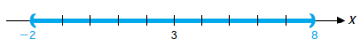
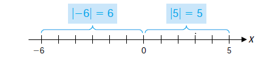

# The Basics {#sec-basics}

::: {.epigraph}
Learning never exhausts the mind.

[— Leonardo da Vinci]{.epigraph-by}
:::

## Number Systems

Mathematics has its own language with numbers as the alphabet. The language is given structure with the aid of connective symbols, rules of operation, and a rigorous mode of thought (logic). The number systems that we use in calculus are the *natural numbers*, the *integers*, the *rational numbers*, and the *real numbers*. Let us describe each of these :

1.  The **natural numbers** are the system of positive counting numbers $1,2,3\dots .$ We denote the set of all natural numbers by $\mathbb{N}$. $$\mathbb{N}=\{1,2,3,4,5,6,7,8,\dots\}.$$

2.  The **integers** are the positive and negative whole numbers and zero, $\dots ,-3,-2,-1,0,1,2,3,\dots .$ We denote the set of all integers by $\mathbb{Z}$. $$\mathbb{Z}=\{\dots, -4,-3,-2,-1,0,1,2,3,4,\dots\}.$$

3.  The **rational numbers** are quotients of integers or **fractions**, such as $\frac{2}{3}, -\frac{5}{4}$. Any number of the form $\dfrac{p}{q}$, with $p,q \in \mathbb{Z}$ and $q\neq 0$, is a rational number. We denote the set of all rational numbers by $\mathbb{Q}$. $$\mathbb{Q}=\left\{\dfrac{p}{q}\biggl|p,q\in \mathbb{Z}, q\neq 0\right\}.$$

4.  The **real numbers** are the set of all decimals, both terminating and non-terminating. We denote the set of all real numbers by $\mathbb{R}$. A decimal number of the form $x=3.16792$ is actually a rational number, for it represents $$x=3.16792=\dfrac{316792}{100000}.$$ A decimal number of the form $$m=4.27519191919\dots ,$$ with a group of digits that repeats itself interminably, is also a rational number. To see this, notice that $$100\cdot m=427.519191919\dots$$ and therefore we may subtract $$\begin{aligned}
    100m=427.519191919\dots \\
    m=4.27519191919\dots
    \end{aligned}$$ Subtracting, we see that $$99m=423.244$$ or $$m=\dfrac{423244}{99000}.$$ So, as we asserted, $m$ is a rational number or quotient of integers. To indicate recurring decimals we sometimes place dots over the repeating cycle of digits, e.g., $m=4.275\dot{1}\dot{9},\ \frac{19}{6}=3.1\dot{6}$.

Another kind of decimal number is one which has a non-terminating decimal expansion *that does not keep repeating*. An example is $\pi=3.14159265\dots$. Such a number is *irrational*, that is, it *cannot* be expressed as the quotient of two integers.

In summary : There are three types of real numbers : (i)  terminating decimals, (ii)  non-terminating decimals that repeat, (iii)  non-terminating decimals that do not repeat. Types (i) and (ii) are rational numbers. Type (iii) are irrational numbers.

The geometric representation of real numbers as points on a line is called the *real axis*. Between any two rational numbers on the line there are infinitely many rational numbers. This leads us to call the set of rational numbers an *everywhere dense set*.

Real numbers are characterised by three fundamental *properties* :

1.  **algebraic** means formalisations of the rules of calculation (addition, subtraction, multiplication, division). Example : $2(3+5)=2\cdot3 +2\cdot 5=6+10=16$.

2.  **order** denote inequalities. Example : $-\dfrac{3}{4}<\dfrac{1}{3}$.

3.  **completeness** implies that there are "no gaps" on the real line.

**Algebraic properties** of the reals for *addition* ($a,b,c\in \mathbb{R}$) are :

::: {.labelled}

- (A1) $a+(b+c)=(a+b)+c$. *associativity*

- (A2) $a+b=b+a$. *commutativity*

- (A3) There is a $0$ such that $a+0=a$. *identity*

- (A4) There is an $x$ such that $a+x=0$. *inverse*

:::

Why these rules? They define an *algebraic structure* (commutative group). Now define analogous algebraic properties for *multiplication* :

::: {.labelled}

- (M1) $a(bc)=(ab)c$.

- (M2) $ab=ba$.

- (M3) There is a $1$ such that $a\cdot 1=a$.

- (M4) There is an $x$ such that $ax=1$ for $a\neq 0$.

:::

Finally, connect *multiplication* and *addition* :

::: {.labelled}

- \(D\) $a(b+c)=ab+ac$. *distributivity*

:::

These $9$ rules define an algebraic structure called a *field*.

**Order properties** of the reals are :

::: {.labelled}

- (O1) for any $a,b\in \mathbb{R}, \, a\leq b$ or $b\leq a$. *totality of ordering I*

- (O2) if $a\leq b$ and $b\leq a$, then $a=b$. *totality of ordering II*

- (O3) if $a\leq b$ and $b\leq c$, then $a\leq c$. *transitivity*

- (O4) if $a\leq b$, then $a+c\leq b+c$. *order under addition*

- (O5) if $a\leq b$ and $c\geq 0$, then $ac\leq bc$. *order under multiplication*

:::

Some useful rules for calculations with inequalities are : If $a,b,c$ are real numbers, then :

1.  if $a<b$ and $c<0 \Rightarrow bc<ac$.

2.  if $a<b \Rightarrow -b<-a$.

3.  if $a>0\Rightarrow \dfrac{1}{a}>0$.

4.  if $a$ and $b$ are both positive or negative, then $a<b\Rightarrow \dfrac{1}{b} <\dfrac{1}{a}$.

The **completeness property** can be understood by the following construction of the real numbers : Start with the counting numbers $1,2,3,\dots .$

- $\mathbb{N}=\{1,2,3,4,\dots \}$ natural numbers $\Rightarrow$ Can we solve $a+x=b$ for $x$?

- $\mathbb{Z}=\{\dots , -2,-1,0,1,2,\dots\}$ integers $\Rightarrow$ Can we solve $ax=b$ for $x$?

- $\mathbb{Q} =\{\frac{p}{q} | p,q \in \mathbb{Z}, q\neq 0\}$ rational numbers $\Rightarrow$ Can we solve $x^2=2$ for $x$?

- $\mathbb{R}$ real numbers, for example : The positive solution to the equation $x^2=2$ is $\sqrt{2}$. This is an irrational number whose decimal representation is not eventually repeating.

$$\Rightarrow \boxed {\mathbb{N}\subset \mathbb{Z}\subset \mathbb{Q}\subset \mathbb{R}}$$ In summary, the real numbers $\mathbb{R}$ are *complete* in the sense that they correspond to all points on the real line, i.e., there are no "holes" or "gaps", whereas the rationals have "holes" (namely the irrationals).

**You Try It :** What type of real number is $3.41287548754875\dots$? Can you express this number in more compact form?

## Intervals

::: {#def-basics-1}

A subset of the real line is called an interval if it contains at least two numbers and all the real numbers between any of its elements.

:::

**Examples :**

1.  $x>-2$ defines an *infinite interval*. Geometrically, it corresponds to a *ray* on the real line.

2.  $3\leq x\leq 6$ defines a *finite interval*. Geometrically, it corresponds to a *line segment* on the real line.

**Finite Intervals.** Let $a$ and $b$ be two points such that $a<b$. By the *open interval* $(a,b)$ we mean the set of all points between $a$ and $b$, that is, the set of all $x$ such that $a<x<b$. By the *closed interval* $[a,b]$ we mean the set of all points between $a$ and $b$ or equal to $a$ or $b$, that is, the set of all $x$ such that $a\leq x\leq b$. The points $a$ and $b$ are called the *endpoints* of the intervals $(a,b)$ and $[a,b]$.

{fig-align="center" width=407px}

By a *half-open interval* we mean an open interval $(a,b)$ together with one of its endpoints. There are two such intervals : $[a,b)$ is the set of all $x$ such that $a\leq x<b$ and $(a,b]$ is the set of all $x$ such that $a<x\leq b$.

**Infinite Intervals.** Let $a$ be any number. The set of all points $x$ such that $a<x$ is denoted by $(a,\infty)$, the set of all points $x$ such that $a\leq x$ is denoted by $[a,\infty)$. Similarly, $(-\infty ,b )$ denotes the set of all points $x$ such that $x<b$ and $(-\infty ,b]$ denotes the set of all $x$ such that $x\leq b$.

{fig-align="center" width=428px}

## Solving Inequalities

Solve inequalities to find intervals of $x\in \mathbb{R}$. Set of all solutions is the *solution set* of the inequality. **Examples:**

1.  $$\begin{aligned}
    2x-1 &<  x+3 \\
    2x &<  x+4\\
    x &<  4.
    \end{aligned}$$

2.  For what values of $x$ is $x+3(2-x)\geq 4-x$? $$\begin{aligned}
    x+3(2-x) &\geq   4-x \quad \text{when} \\
    x+6-3x &\geq   4-x\\
    6-2x &\geq   4-x\\
    2 &\geq  x \Rightarrow x\leq 2.
    \end{aligned}$$

3.  For what values of $x$ is $(x-4)(x+3)<0$?

    **Case 1:** $(x-4)>0$ and $(x+3)<0, \Longrightarrow x>4$ and$x<-3$.
    **Impossible** since $x$ cannot be both greater than $4$ and less than $-3$.
    **Case 2:** $(x-4)<0$ and $(x+3)>0, \Longrightarrow x<4$ and $x>-3\Longrightarrow -3<x<4$.

**You Try It:** Solve the inequality $\dfrac{2}{x-1}<\dfrac{3}{2x+1}$.

## The Absolute Value

It is a quantity that gives the *magnitude* or *size* of a real number. The **absolute value** or **modulus** of a real number $x$, denoted by $|x|$, is given by $$|x| = \left\{ 
\begin{array}{l l}
  x, & \quad \text{if}~~~ x\geq 0 \\
 -x, & \quad \text{if}~~~ x<0.\\ \end{array} \right.$$ Geometrically, $|x|$ is the distance between $x$ and $0$. For example, $|-6|=6, \, |5|=5, \, |0|=0$.

{fig-align="center" width=425px}

### Properties of the Absolute Value 

1.  The absolute value of a real number $x$ is non-negative, that is, $|x|\geq 0$.

2.  The absolute value of a real number $x$ is zero if and only if $x=0$, that is, $|x|=0\Longleftrightarrow x=0$.

3.  In general, if $x$ and $y$ are any two numbers, then

    1.  $-|x|\leq x\leq |x|$.

    2.  $|-x|=|x|$ and $|x-y|=|y-x|$.

    3.  $|x|=|y|$ implies $x=\pm y$.

    4.  $|xy|=|x|\cdot |y|$ and $\left|\dfrac{x}{y}\right|=\dfrac{|x|}{|y|}$ if $y\neq 0$.

    5.  $|x+y|\leq |x|+|y|$. (Triangle inequality)

4.  If $a$ is any positive number, then

    1.  $|x|=a$ if and only if $x=\pm a$.

    2.  $|x|<a$ if and only if $-a<x<a$.

    3.  $|x|>a$ if and only if $x>a$ or $x<-a$.

    4.  $|x|\leq a$ if and only if $-a\leq x\leq a$.

    5.  $|x|\geq a$ if and only if $x\geq a$ or $x\leq -a$.

**Example:** Show that for all real numbers $x$, $|-x|=|x|$.
**Solution:** If $x\in \mathbb{R}$, then either $x>0, x=0$ or $x<0$. If $x>0$, then $-x<0$. Thus, $|-x|=-(-x)=x=|x|$, that is, $|-x|=|x|$.
If $x=0$, then $|-x|=|-0|=|0|=0$, that is, $|-x|=|x|$.
If $x<0$, then $-x>0$. Now $|x|=-x=|-x|$ since $-x>0$.
Therefore in all cases $|-x|=|x|$.

**Solving an Equation with Absolute Values:** Solve the equation $|2x-3|=7$.

**Solution:** Hence $2x-3=\pm 7$, so there are two possibilities, $$\begin{aligned}
2x-3 &=  7 \quad  \quad 2x-3 =-7\\
2x &=  10 \quad \quad 2x = -4\\
x &=  5 \quad \quad x = -2
\end{aligned}$$ The solutions of $|2x-3|=7$ are $x=5$ and $x=-2$.

**Solving Inequalities Involving Absolute values:** Sole the inequality $\left |5-\dfrac{2}{x}\right |<1$.

**Solution:** We have $$\begin{aligned}
\left |5-\dfrac{2}{x}\right |<1 & \Longleftrightarrow &  -1<5-\dfrac{2}{x}<1\\
& \Longleftrightarrow & -6<-\dfrac{2}{x}<-4\\
 & \Longleftrightarrow & 3>\dfrac{1}{x}> 2\\
& \Longleftrightarrow  & \dfrac{1}{3}<x<\dfrac{1}{2}.
\end{aligned}$$ Solve the inequalities and show the solution set on the real line. (a)  $|2x-3|\leq 1$ (b)  $|2x-3|\geq 1$.

**Solution:** (a)$$\begin{aligned}
|2x-3|\leq 1  & \Longleftrightarrow & -1\leq 2x-3 \leq 1\\
& \Longleftrightarrow &  2\leq 2x\leq 4\\
 &\Longleftrightarrow & 1\leq x\leq 2.
\end{aligned}$$ The solution set is the closed interval $[1,2]$.

(b)$$\begin{aligned}
|2x-3|\geq 1\Longleftrightarrow 2x-3\geq 1 \quad \text{or} \quad 2x-3 \leq -1 \\
\Longleftrightarrow x \geq 2 \quad \text{or} \quad x\leq 1.
\end{aligned}$$ The solution set is $(-\infty , 1]\cup [2, \infty )$.

**You Try It:** Solve the inequality $4|x|<7x-6$.

## The Principle of Mathematical Induction

It is an important property of the positive integers (natural numbers) and is used in proving statements involving all positive integers when it is known for, for example, that the statements are valid for $n=1,2,3,\dots$ but it is *suspected* or *conjectured* that they hold for all positive integers.

### Steps

1.  Prove the statement for $n=1$ or some other positive integer. (Initial Step)

2.  Assume the statement true for $n=k$, where $k\in \mathbb{Z}^+$. (Inductive Hypothesis)

3.  From the assumption in $2$ prove the statement must be true for $n=k+1$.

4.  Since the statement is true for $n=1$ (from $1$) it must (from $3$) be true for $n=1+1=2$ and from this for $n=2+1=3$, and so on, so must be true for all positive integers. (Conclusion)

**Example:** For any positive integer $n$, $$1+2+\cdots + n=\dfrac{n(n+1)}{2}.$$ **Solution:**

1.  Prove for $n=1$, $1=\dfrac{1(1+1)}{2}=\dfrac{2}{2}=1$, which is clearly true.

2.  Assume that the statement holds for $n=k$, that is, $$1+2+\cdots +k =\dfrac{k(k+1)}{2}.$$

3.  Prove for $n=k+1$. So $$\begin{aligned}
    1+2+\cdots + k+(k+1) &=  \dfrac{k(k+1)}{2}+(k+1)\quad \text{(by inductive hypothesis)}\\
    &=  \dfrac{k(k+1)+2(k+1)}{2}\\
    &=  \dfrac{k^2+3k+2}{2}\\
    &=  \dfrac{(k+1)(k+2)}{2}
    \end{aligned}$$ so holds for $n=k+1$.

4.  Hence by induction, $1+2+\cdots +n=\dfrac{n(n+1)}{2}$ is true for any positive integer $n$.

**Example:** Prove that for any natural number $$1+3+5+\cdots + 2n-1=n^2.$$ **Solution:**

1.  Prove for $n=1$, $1=1^2=1$, so it is true.

2.  Assume that the statement holds for $n=k$, that is, $$1+3+5+\cdots +2k-1=k^2.$$

3.  Prove for $n=k+1$. We have $$\begin{aligned}
    1+3+5+\cdots +(2k-1)+2(k+1)-1 &=  k^2+2k+1\quad \text{(by inductive hypothesis)}\\
    &=  (k+1)^2.
    \end{aligned}$$ So it is true for $n=k+1$.

4.  Hence by induction $1+3+5+\cdots + 2n-1=n^2$ is true for all natural numbers $n$.

**Example:** Prove that $3^n>2^n$ for all natural numbers $n$.
**Solution:**

1.  Prove for $n=1 \Longrightarrow 3^1=3>2^1=2$, which is true.

2.  Assume the statements holds for $n=k$, that is, $3^k>2^k$.

3.  Prove for $n=k+1$. $$\begin{aligned}
    3^{k+1} &=  3^k\cdot 3\\
    &>  2^k \cdot 3 \quad \text{by inductive hypothesis}\\
    &>  2^k\cdot 2 \quad \text{since $3>2$}\\
    &>  2^{k+1},
    \end{aligned}$$ which is true.

4.  Hence, by induction $3^n>2^n$ for all natural numbers $n$.

**Example:** Prove that for any integer $n\geq 1$, $2^{2n}-1$ is divisible by $3$.
**Solution:**

1.  Prove for $n=1 \Longrightarrow 2^2-1=3$ and is divisible by $3$, hence its true.

2.  Assume that the statement holds for $n=k$, that is, for $k\geq 1$, $2^{2k}-1$ is divisible by $3$, i.e., $2^{2k}-1=3l$, for some $l\in \mathbb{Z}$.

3.  Prove for $n=k+1$. $$\begin{aligned}
    2^{2(k+1)}-1 &=  4\cdot 2^{2k} -1 \quad \text{but $2^{2k}=3l+1$ by the inductive hypothesis}\\
    &=  4(3l+1)-1\\
    &=  12l+4-1\\
    &=  12l+3\\
    &=  3(4l+1), 
    \end{aligned}$$ which is true.

4.  Hence, by induction $2^{2n}-1$ is divisible by $3$ for all $n\geq 1$.

## Tutorial questions {.unnumbered}

::: {.tutorial}

1.  Find a rational number whose decimal expansion is $1.63636363\dots$.

2.  Explain why $\pi \neq \frac{22}{7}$.

3.  State, giving a reason, whether each of the following numbers is rational or irrational.
    (i)  $0.20200200020\dots$ (ii)  $537.137137137\dots$.

4.  Show that $a^2+b^2 \geq 2ab$, for all $a,b \in \mathbb{R}$.

5.  Show that if $a^2+b^2=1$ and $c^2+d^2=1$, then $ac+bd \leq 1$.

6.  Show that if $0<a<b$ then $a^2<b^2$. If $a^2<b^2$, is it necessarily true that $a<b$? Give an example to illustrate your answer.

7.  Solve the following inequalities.
    (i)  $|x+1| \geq 3$ (ii)  $\dfrac{2x+3}{x-5}>3$ (iii)  $2|x|>3x-10$ (iv)  $x^2+x-2>0$
    (v)  $2|x|-1>3|x|-3$ (vi)  $4|x|<7x-6$ (vii)  $\dfrac{|x|+2}{x-2}<4$ (viii)  $|x-4|=9$.

8.  Prove that $|ab|=|a||b|$ for all $a,b \in \mathbb{R}$.

9.  Show that $|a+b|\leq |a|+|b|$ for all $a,b \in \mathbb{R}$.

10. Prove that $|x|^2=x^2$ for any real number $x$.

11. If $x$ and $y$ are real numbers, prove that $|x|-|y|\leq |x-y|$.

12. Prove the following by induction.

    ::: {.labelled}

    - \(a\) $n! >2^n$ for all $n \geq 4$.

    - \(b\) For all $n\geq 1$ and $f(x)=x^n$, then $f'(x)=nx^{n-1}$.

    - \(c\) $n^2 \leq 2^n$ for all $n \geq 5$.

    - \(d\) The sum of terms in a geometric series is $\displaystyle \sum _{i=0}^{n}{r^i}=\dfrac{r^{n+1}-1}{r-1}$, if $r \neq 0, r \neq 1, n\in \mathbb{N}$.

    - \(e\) $1+2+ \cdots +n =\dfrac{n(n+1)}{2}$.

    - \(f\) For any positive integer $n$, $n^3+2n$ is divisible by $3$.

    - \(g\) $3^n>n^2$ for $n>2$.

    - \(h\) $7^{2n}-48n-1$ is divisible by $2304$.

    - \(i\) All numbers of the form $8^n-2^n$ are divisible by $6$.

    - \(j\) $11^n-4^n$ is divisible by $7$ for all $n \in \mathbb{Z ^+}$.

    - \(k\) $|\sin nx| \leq n|\sin x|$ for all $x \in \mathbb{R}, n \in \mathbb{Z ^+}$.

    - \(l\) $1^3+2^3+3^3+\cdots +n^3=\dfrac{n^2(n+1)^2}{4}$.

    - \(m\) Prove *Bernoulli's inequality*, $(1+x)^n>1+nx$, for $n=2,3,\dots$, if $x>-1, \, x\neq 0$.

    - \(n\) $1^2+2^2+3^2+\cdots +n^2=\dfrac{1}{6}n(n+1)(2n+1)$.

    - \(o\) Prove that if $a_1, a_2, a_3, \dots , a_n$ are real numbers, then $$|a_1+a_2+\cdots +a_n|\leq |a_1| +|a_2|+\cdots +|a_n|.$$

    - \(p\) Prove that, if $\sin x \neq 0$ and $n$ is a natural number, then $$\cos x \cdot \cos 2x \cdot \cdots \cos 2^{n-1} x =\dfrac{\sin 2^n x}{2^n\sin x}.$$

    :::

:::
