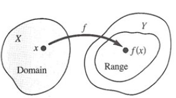
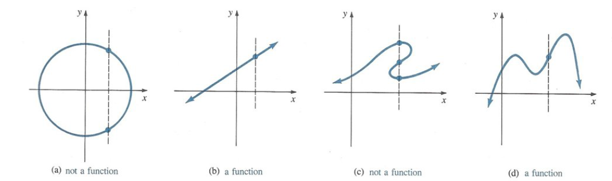
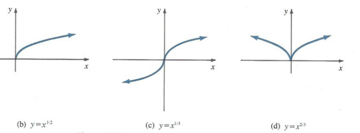
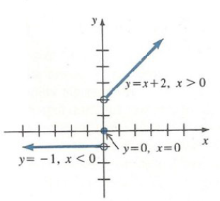
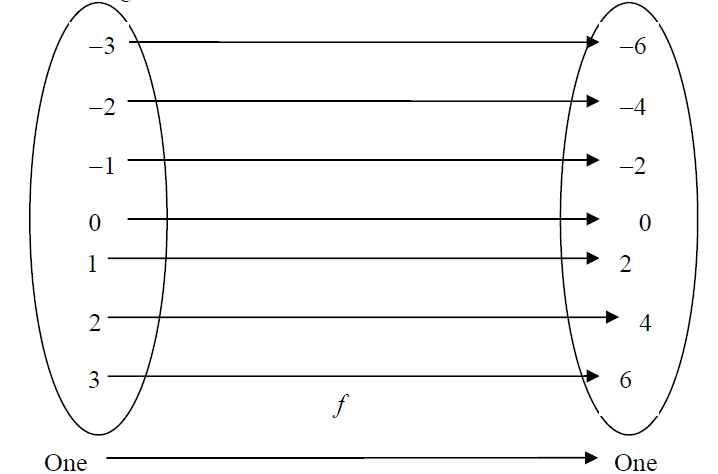
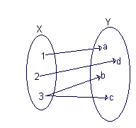
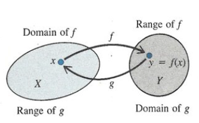
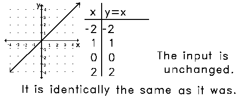

# Functions {#sec-functions}

::: {.epigraph}
We know that God exists because Mathematics is consistent and we know that the devil exists because we cannot prove the consistency.

[— Andre Weil]{.epigraph-by}
:::

## What is a Function?

A function is a *rule* or a *correspondence*, relating two sets in such a manner that each element in the first set corresponds to one and only one element in the second set. What do we mean when we say $\boxed{y ~~is~~ a ~~function~~ of~~ x?}$ Symbolically, we write $y=f(x)$, where

1.  $x$ is the *independent variable*. (input value of $f$)

2.  $y$ is the *dependent variable*. (output value of $f$ at $x$)

3.  $f$ is a *function*. (rule that assigns $x$ to $y$)

::: {#def-functions-1}

A function $f$ from a set $X$ to a set $Y$ is a rule that assigns to each element $x$ in $X$ a unique element $y$ in $Y$.

:::

The set $X$ is called the **domain** of $f$ and the set of corresponding elements $y$ in $Y$ is called the **range** of $f$ where sets $X$ and $Y$ consists of real numbers. We write $f :X\to Y$.

**Examples:** Stock market index depending on time, volume of sphere depending on radius, circle of a given radius has only one area.

Let $f$ be a function. The number $y$ in the range that corresponds to a selected number $x$ in the domain is said to be the value of the function at $x$, or **image** of $x$, written $f(x)$, so $y=f(x)$.

**Examples:** $f(x)=3x^4+2$, $g(t)=4-t^2$, $h(s)=2s^2+7$.

The **domain** of a function $f$ is the largest set of real numbers for which the rule makes sense.

{fig-align="center" width=300px}

**Example:** Let $f(x)=\dfrac{1}{x}$, we cannot compute $f(0)$, since $\dfrac{1}{0}$ is not defined. Then the domain of $f(x)=\dfrac{1}{x}$ is the set of all real numbers except $0$.

::: {#tbl-domain-range}
  **Function**              **Domain** $x\in X$               **Range** $y\in Y$
  ------------------ --------------------------------- ---------------------------------
  $y=x^2$                  $(-\infty , \infty)$                  $[0,\infty)$
  $y=\dfrac{1}{x}$    $(-\infty , 0)\cup (0, \infty)$   $(-\infty , 0)\cup (0, \infty)$
  $y=\sqrt{x}$                 $[0,\infty )$                     $[0,\infty )$
  $y=\sqrt{1-x^2}$               $[-1,1]$                           $[0,1]$

  : Examples of functions
:::

**You Try It:** Let $$g(x)=\dfrac{x}{x^2+4x+3}.$$ What is the domain and range of this function?

## Graphs of Functions

It is useful to draw pictures which represent functions. These pictures, or *graphs*, are a device for helping us to think about functions. We graph functions in the $x-y$ pane. The elements of the domain of the function are thought of as points of the $x-$axis. The values of a function are measured on the $y-$axis.The graph of $f$ associates to $x$ a unique $y$ value that the function $f$ assigns to $x$. The **graph** of a function $f$ is the set of points $\{(x,y)| y=f(x) \quad \text{in the domain of $f$}\}$ in the Cartesian plane.

As a consequence, a function is characterised geometrically by the fact that any vertical line intersecting its graph does so in *exactly one point*.

{fig-align="center" width=620px}

## Bounded Functions

If there is a constant $M$ such that $f(x)\leq M$ for all $x$ in the interval (or other set of numbers), we say that $f$ is *bounded above* in the interval (or the set) and call $M$ an *upper bound* of the function. If a constant $m$ exists such that $f(x)\geq m$ for all $x$ in an interval, we sat that $f(x)$ is *bounded below* in the interval and call $m$ a *lower bound*. If $m\leq f(x)\leq M$ in an interval, we call $f(x)$ *bounded*.

**Examples:** $f(x)=x+3$ is bounded in $-1\leq x\leq 1$. An upper bound is $4$ (or any number grater than $4$). A lower bound is $2$ (or any number less than $2$).

## Types of Functions

### Elementary Functions

#### Polynomial Function

Have the form $f(x)=a_0x^n+a_1x^{n-1}+\cdots + a_{n-1}x+a_n$ where $a_0, a_1, \dots , a_n$ are constants and $n$ is a positive integer called the degree of the polynomial provided $a_0\neq 0$.

**Examples:** $x^5+10x^3-2x+1$ is a polynomial of degree $5$.

#### Rational Functions

A function $f(x)=\dfrac{P(x)}{Q(x)}$ where $P(x)$ and $Q(x)$ are polynomial functions.

**Example:** $f(x)=\dfrac{x^3+x+5}{x^2-3x-4}$ is a rational function. Since $(x+1)(x-4)$ and $(x+1)(x-4)=0$ for $x=-1$ and $x=4$, the domain of $f$ is the set of all real numbers except $-1$ and $4$.

#### Power Function

$f(x)=kx^n$, $n$ a real number and $k$ a constant.

{fig-align="center" width=620px}

**Examples:** $y=\dfrac{1}{x}$, $y=x^{\frac{1}{2}}$, $y=x^{\frac{2}{3}}$.

#### Piecewise Defined Functions

A function need not be defined by a single formula. A piecewise defined function is a function described by using *different formula on different parts of its domain*.

**Examples:** (a)  $f(x) = \left\{ 
\begin{array}{l l}
  -1, & \quad  x<0 \\
 0, & \quad x=0\\
 x+2, & \quad x>0\\ \end{array} \right.$ (b)  $f(x) = \left\{ 
\begin{array}{l l}
  -x, & \quad  x< 0 \\
 x^2, & \quad 0\leq x\leq 1\\
 1, & \quad x>1.\\ \end{array} \right.$

{fig-align="center" width=311px}

#### Transcendental Functions {#transcendental-functions .unnumbered}

The following are sometimes called *elementary transcendental functions*.

1.  Exponential function, $f(x)=a^x, a\neq 0,1$.

2.  Logarithmic function, $f(x)=\log _a x, a\neq 0,1$.

3.  Trigonometric functions (also called circular functions because of their geometric interpretation with respect to the unit circle), e.g., $\sin x, \cos x, \tan x =\dfrac{\sin x}{\cos x}, \csc x, \cot x, \sec x$.

4.  Inverse trigonometric functions, e.g., $y=\sin ^{-1} x, y=\cos ^{-1} x$.

5.  Hyperbolic Functions, e.g., $\sinh x, \cosh x, \tanh x, \coth x$.

#### Even and Odd Functions

Let $f(x)$ be a *real-valued* function of a real variable. Then $f$ is *even* if $f(x)=f(-x)$. (Symmetric with respect to the $y-$axis)

**Examples:** $|x|, x^2, x^4, \cos x, \cosh x$.

Let $f(x)$ be a real-valued function of a real variable. Then $f$ is *odd* if $-f(x)=f(-x)$ or
$f(x)+f(-x)=0$. (Symmetric with respect to the origin)

**Examples:** $x, x^3, \sin x, \sinh x$.

**Example:** Determine whether the following function is odd or even $f(x)=\dfrac{3x}{x^2+1}$.

**Solution:** $$f(-x)=\dfrac{3(-x)}{(-x)^2+1}=-\dfrac{3x}{x^2+1}=-f(x).$$ The function is odd.

## Combining Functions

A function $f$ can be combined with another function $g$ by means of arithmetic operations to form other functions, the **sum** $f+g$, **difference** $f-g$, **product** $fg$ and **quotient** $\dfrac{f}{g}$ are defined as : Let $f$ and $g$ denote functions, then

1.  [Sum]{.underline} : $(f+g)(x)=f(x)+g(x)$.

2.  [Difference]{.underline} : $(f-g)(x)=f(x)-g(x)$.

3.  [Product]{.underline} : $(fg)(x)=f(x)g(x)$.

4.  [Quotient]{.underline} : $\left(\dfrac{f}{g}\right )(x)=\dfrac{f(x)}{g(x)}$.

**Example:** If $f(x)=2x^2-5$ and $g(x)=3x+4$. Find $f+g, f-g, fg, \dfrac{f}{g}$.

**Solution:** $$\begin{aligned}
(f+g)(x) &=  (2x^2-5)+(3x+4)= 2x^2+3x-1.\\
(f-g)(x)&=  (2x^2-5)-(3x+4)= 2x^2-3x-9.\\
(fg)(x)&= (2x^2-5)(3x+4) = 6x^3+8x^2-15x-20\\
\left(\dfrac{f}{g}\right)(x)&=  \dfrac{2x^2-5}{3x+4}.\\
\end{aligned}$$

## Composition of Functions

Let $f$ and $g$ denote functions. The **composition** of $f$ and $g$, written $f\circ g$ is the function $(f\circ g)(x)=f(g(x))$ and the composition of $g$ and $f$, written $g\circ f$, is the function $(g\circ f)(x)=g(f(x))$.

**Example:** If $f(x)=x^2$ and $g(x)=x^2+1$, find $f\circ g$ and $g \circ f$.

**Solution:** $$(f\circ g)(x)=f(g(x))=f(x^2+1)=(x^2+1)^2=x^4+2x^2+1.$$ and $$(g\circ f)(x)=g(f(x))=g(x^2)=(x^2)^2+1=x^4+1.$$ In general, $f\circ g \neq g\circ f$.

## Bijection, Injection and Surjection

Classes of functions may be distinguished by the manner in which arguments and images are related or *mapped* to each other.

A function $f:X\to Y$ is **injective (one-to-one, $1-1$)** if every element of the range corresponds to exactly one element in its domain $X$.

For all $x,y\in X$, $f(x)=f(y)\Longrightarrow x=y$ or equivalently

For all $x,y\in X$, $x\neq y\Longrightarrow f(x)\neq f(y)$. An injective function is an **injection**.

{fig-align="center" width=620px}

**Example:** Show that the functions $f(x)=2x+3$ and $g(x)=x^3-2$ are injective.

**Solution:** Need to show that $f(x)=f(y)\Longrightarrow x=y$. $$\begin{aligned}
2x+3 &=  2y+3 \\
2x &=  2y \Longrightarrow x =y.\\
\end{aligned}$$ Hence $f(x)=2x+3$ is injective.

Need to show that $g(x)=g(y)\Longrightarrow x=y$. $$\begin{aligned}
x^3-2 &=  y^3-2 \\
x^3 &=  y^3 \quad  \text{taking cube roots}\\
x &=  y.
\end{aligned}$$ Hence $g(x)=x^3-2$ is injective.

A function $f:X\to Y$ is called **onto** if for all $y$ in $Y$ there is an $x$ in $X$ such that $f(x)=y$. All elements in $Y$ are used. Such functions are referred to as **surjective**.

{fig-align="center" width=192px}

**Example:** Show that $f(x)=3x-5$ is onto.

**Solution:** For *onto* $f(x)=y$, i.e., $3x-5=y$. Solve for $x$, $\Longrightarrow x=\dfrac{y+5}{3}$.
So $f\left (\dfrac{y+5}{3}\right)=3\left(\dfrac{y+5}{3} \right)-5=y$. Therefore $f$ is onto.

Let $X$ and $Y$ be sets. A function $f:X\to Y$ that is one-to-one and onto is called a *bijection* or *bijective function from $X$ to $Y$*. If $f$ is both one-to-one and onto, then we call $f$ a $1-1$ correspondence.

**Inverse of a Function.** Suppose $f$ is a $1-1$ function that has domain $X$ and range $Y$. Since every element $y\in Y$ corresponds with precisely one element $x$ of $X$, the function $f$ must actually determine a *reverse* function $g$ whose domain is $Y$ and range is $X$, where $f$ and $g$ must satisfy $f(x)=y$ and $g(y)=x$. The function $g$ is given the formal name *inverse* of $f$ and usually written $f^{-1}$ and read $f$ inverse. Not all functions have inverses, those that do are called *invertible functions*.

{fig-align="center" width=334px}

**Example:** Find the inverse of the function $f(x)=(2x+8)^3$.

**Solution:** We must solve the equation $y=(2x+8)^3$ for $x$. $$\begin{aligned}
y &=  (2x+8)^3\\
\sqrt[3]{y} &=  2x+8 \\
\sqrt[3]{y}-8 &=  2x \\
x &=  \dfrac{\sqrt[3]{y}-8}{2}.
\end{aligned}$$ Hence the inverse function $f^{-1}$ is given by $f^{-1}(x)= \dfrac{\sqrt[3]{x}-8}{2}$.

A $1-1$ function $f$ can have only one inverse, i.e., $f^{-1}$ is unique. A function $f:X\to Y$ is **invertible** if and only if $f$ is one-to-one and maps $X$ onto $Y$.

## Operations on Functions

#### Equality of Functions

Equality of functions does not mean the same as equality of two numbers (numbers have a fixed value but values of functions vary). Each function is a relationship between $x$ and $y$, the two relationships are the same if for every value of $x$ we get the same value of $y$.

**Example:** The functions $(x-1)(x+2)$ and $x^2+x-2$ are equal.

**Example:** Equal functions for positive values of $x$, $$|x| =\sqrt{x^2}.$$

#### Identity Function

Generally, an identity function is one which does not change the domain values at all. Its the function $f(x)=x$. Denoted by $I_X$.

{fig-align="center" width=487px}

#### Monotonic Functions

A function is called *monotonic increasing* in an interval, if for any two points $x_1$ and $x_2$ in the interval such that if $x_1<x_2, \, f(x_1)\leq f(x_2)$. If $f(x_1)<f(x_2)$ the function is called *strictly increasing*.

**Similarly**, if $f(x_1)\geq f(x_2)$ whenever $x_1< x_2$, then $f(x)$ is *monotonic decreasing*, while if
$f(x_1)>f(x_2)$ it is *strictly decreasing*.

## Tutorial questions {.unnumbered}

::: {.tutorial}

1.  Find the domain of each of the following functions.
    (i)  $-\sqrt{9-x^2}$ (ii)  $\dfrac{1}{\sqrt{1-x}}$ (iii)  $\dfrac{1}{2x+3}$ (iv)  $\sqrt{(3-x)(2x+4)}$ (v)  $\dfrac{x-2}{x^2-4}$
    (vi)  $\ln (x^3-3x^2-4x+12)$ (vii)  $\dfrac{x^3-8}{x^2-4}$ (viii)  $\sqrt{\sin 5x}$ (ix)  $\ln (2x^2-5x-12)$
    (x)  $\dfrac{1}{\sqrt{9-x^2}}$ (xi)  $\sqrt{x^2-4}$ (xii)  $x^2+4$ (xiii)  $\sqrt{\dfrac{x}{2-x}}$.

2.  If $f(x)=\dfrac{x-1}{x+1}$, find (i)  $f(0)$ (ii)  $f(1)$ (iii)  $f(-2)$. Show that $f\left(\dfrac{1}{x}\right)=-f(x)$ and $f\left(-\dfrac{1}{x}\right)=-\dfrac{1}{f(x)}$.

3.  If $f(x)=\dfrac{1}{x}$, show that $f(a)-f(b)=f\left(\dfrac{ab}{b-a} \right)$.

4.  If $f(x)=x^2-x$, show that $f(x+1)=f(-x)$.

5.  If $y=f(x)=\dfrac{5x+3}{4x-5}$, show that $x=f(y)$.

6.  Determine whether or not each of the following correspondences is a function.
    (i)  $x^2+y=1$ (ii)  $x^2y^2=5$ (iii)  $x^2y=4$ (iv)  $\{(1,5), (2,5), (5,1)\}$.

7.  For each of the following pairs of functions, calculate $f\circ g$ and $g\circ f$.

    ::: {.labelled}

    - \(i\) $f(x)=\sin (x+3x^2)$ and $g(x)=\cos (x^2-x)$.

    - \(ii\) $f(x)=e^{x^2}$ and $g(x)=e^{-x^2}$.

    - \(iii\) $f(x)=x(x+1)(x+2)$ and $g(x)=(2x-3)(x+4)$.

    :::

8.  Determine whether each of the pairs of the following functions are equal and if they are not equal, give where they are equal.
    (i)  $f(x)=\sqrt{x^2}, \quad g(x)=(\sqrt{x})^2$ (ii)  $f(x)=x^2, \quad g(x)=x|x|$.

9.  Show that if $ad-bc\neq 0$, then the function $f(x)=\dfrac{ax+b}{cx+d}$ is one-to-one and find its inverse, stating the domains of both the function and its inverse. What happens if $ad-bc=0$?

10. Show that these functions are a one-to-one correspondence. Find their inverses.
    (i)  $f(x)=2x+3$ (ii)  $g(x)=x^3-2$ (iii)  $h(x)=(x-2)^2$ (iv)  $k(x)=\sqrt[3]{x}+7$.

11. Show that the function $f(x)=\ln (x+\sqrt{x^2+1})$ is an odd function and find the inverse function of $f(x)$.

:::
