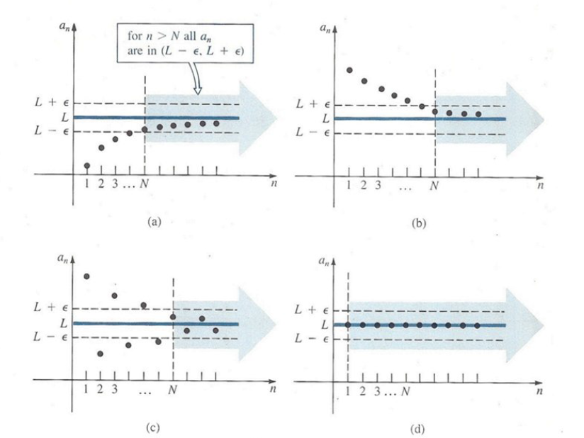

# Sequences {#sec-sequences}

::: {.epigraph}
A girl and a boy jump into a river. The boy swims over to the girl and says, “God, it's cold." What's the probability they will kiss?

[— Jenny Downham, You Against Me]{.epigraph-by}
:::

::: {#def-sequences-1}

A **sequence** is a set of numbers $u_1, u_2, u_3, \dots$ in a definite order of arrangement and formed according to a definite rule.

:::

Each number in the sequence is called a *term* and $u_n$ is called the *$n$th term*. The sequence $u_1,u_2,u_3, \dots$ is written briefly as $\{u_n\}$, e.g., $\{u_n\}=2n$, where $u_1=2$, $u_2=4$, $u_3=6$ and so on. A sequence can be *finite* or *infinite*. A finite sequence has only definite number of terms. An infinite sequence is non-terminating, e.g., $u_n=\dfrac{1}{2n-1}$.

**Recursive Definitions.** The values of the terms in a sequence may be given explicitly by formulas such as $u_n=n^3-73n$.

A **recursive calculation** finds the value of $u_n$ by looking to see which terms $u_n$ depends on, then which terms depend, and so on.

**Example:** $u_0=1, \quad u_{n+1}=\dfrac{2}{u_n}, \quad n\in \mathbb{N}$.

**Solution:** $$\begin{aligned}
u_1 &=  u_{0+1} = \dfrac{2}{u_0}=\dfrac{2}{1}=2\\
u_2 &=  u_{1+1}= \dfrac{2}{u_1} =\dfrac{2}{2}=1\\
u_3 &=  u_{2+1} = \dfrac{2}{u_2} =\dfrac{2}{1}=2.
\end{aligned}$$ **You Try It:** Define recursively $$a_0=a_1=1, \quad \text{and} \quad a_n=a_{n-1}+2a_{n-2}, \, n\geq 2.$$ Find $a_6$ recursively.

## Limits of Sequences

Lets consider the sequence $u_n=\dfrac{1}{n}$. The sequence has the terms $1, \frac{1}{2}, \frac{1}{3}, \frac{1}{4}, \dots$. We see that the terms of the sequence *tend to* or *approach* $0$.

::: {#def-sequences-2}

A number $L$ is called the **limit** of an infinite sequence $a_1, a_2,a_3, \dots$ or $\{a_n\}$, if for any positive number $\varepsilon$, we can find a positive number $N$ depending on $\varepsilon$ such that $|a_n-L|<\varepsilon$ for all integers $n>N$. We write $\displaystyle \lim _{n\rightarrow \infty} a_n=L$.

:::

If $\{a_n\}$ is a convergent sequence, it means that the terms $a_n$ can be made arbitrarily close to $L$ for $n$ sufficiently large.

{fig-align="center" width=620px}

**Example:** If $u_n=3+\dfrac{1}{n}=\dfrac{3n+1}{n}$, the sequence is $4, \frac{7}{2}, \frac{10}{3}, \dots$and we can show that
$\displaystyle \lim _{n\rightarrow \infty} u_n=3$.

If the limit of a sequence exists, the sequence is called **convergent**, otherwise, it is called **divergent**.

**Example:** Prove that $\displaystyle \lim _{n\rightarrow \infty} \frac{1}{n}=0$.

**Proof:** Let $\varepsilon >0$, we can find $N(\varepsilon)$ such that $\left|\dfrac{1}{n}-0\right|=\left|\dfrac{1}{n}\right|=\dfrac{1}{n} <\varepsilon$. But $n>\dfrac{1}{\varepsilon}$. So $N=\dfrac{1}{\varepsilon}$. Taking $N$ to be the smallest integer greater than $\dfrac{1}{\varepsilon}$, we have, $\displaystyle \lim _{n\rightarrow \infty} \dfrac{1}{n}=0$.

**You Try It:** Prove that $\displaystyle \lim _{n\rightarrow 0} \dfrac{1}{n^p}=0$ if $p\in \mathbb{N}$.

**Example:** Use the definition of a limit to prove that $\displaystyle \lim _{n\rightarrow \infty} \dfrac{2n-1}{3n+2}=\dfrac{2}{3}$.

**Proof:** Let $\varepsilon >0$, we can find $N(\varepsilon)$ such that $$\left|\dfrac{2n-1}{3n+2}-\dfrac{2}{3}\right| =\left|\dfrac{3(2n-1)-2(3n+3)}{3(3n+2)}\right| =\left|\dfrac{6n-3-6n-4}{3(3n+2)}\right|=\left|\dfrac{-7}{3(3n+2)}\right|= \left|\dfrac{7}{3(3n+2)}\right|<\varepsilon$$ $$\begin{aligned}
\dfrac{7}{3(3n+2)} &<  \varepsilon \\
n &>  \dfrac{7-6\varepsilon}{9\varepsilon}.
\end{aligned}$$ Take $N=\dfrac{7-6\varepsilon}{9\varepsilon}$. So taking $N$ to be the smallest integer greater than $\dfrac{7-6\varepsilon}{9\varepsilon}$, we have
$\left|\dfrac{2n-1}{3n+2}-\dfrac{2}{3}\right|<\varepsilon$ , i.e., $\displaystyle \lim _{n\rightarrow \infty} \dfrac{2n-1}{3n+2}=\dfrac{2}{3}$.

## Theorems on Limits

If $\displaystyle \lim _{n\rightarrow \infty} a_n =A$ and $\displaystyle \lim _{n\rightarrow \infty} b_n =B$, then

1.  $\displaystyle \lim _{n\rightarrow \infty} (a_n +b_n) = \lim _{n\rightarrow \infty} a_n + \lim _{n\rightarrow \infty} b_n =A +B$.

2.  $\displaystyle \lim _{n\rightarrow \infty} (a_n-b_n) = \lim _{n\rightarrow \infty} a_n-\displaystyle \lim _{n\rightarrow \infty} b_n =A-B$.

3.  $\displaystyle \lim _{n\rightarrow \infty} (a_n\cdot b_n)=(\lim _{n\rightarrow \infty} a_n)(\lim _{n\rightarrow \infty} b_n)=AB$.

4.  $\displaystyle \lim _{n\rightarrow \infty} \dfrac{a_n}{b_n}=\dfrac{\displaystyle \lim _{n\rightarrow \infty} a_n}{\displaystyle \lim _{n\rightarrow \infty} b_n} =\dfrac{A}{B}$ if $\displaystyle \lim _{n\rightarrow \infty} b_n =B\neq 0$.

5.  The limit of a convergent sequence $\{u_n\}$ of real numbers is unique.

**Proof:** We must show that if $\displaystyle \lim _{n\rightarrow \infty} u_n=l_1$ and $\displaystyle \lim _{n\rightarrow \infty} u_n=l_2$, then $l_1=l_2$. By *hypothesis*, given any $\varepsilon >0$, we can find $N$ such that $|u_n-l_1|<\dfrac{\varepsilon}{2}$ when $n>N$ and $|u_n-l_2|<\dfrac{\varepsilon}{2}$ when $n>N$. Then $$|l_1-l_2|=|l_1-u_n+u_n-l_2| \leq |l_1-u_n|+|u_n-l_2|<\dfrac{\varepsilon}{2}+\dfrac{\varepsilon}{2}=\varepsilon ,$$ i.e., $|l_1-l_2|$ is less than any positive $\varepsilon$ (however small) and so must be zero, i.e., $l_1-l_2=0\Longrightarrow l_1=l_2$.

**Example:** If $\displaystyle \lim _{n\rightarrow \infty} a_n=A$ and $\displaystyle \lim _{n\rightarrow \infty} b_n=B$, prove that $\displaystyle \lim _{n\rightarrow \infty} (a_n +b_n )=A+B$.

**Proof:** We must show that for any $\varepsilon >0$, we can find $N>0$, such that $|(a_n+b_n)-(A+B)|<\varepsilon$ for all $n>N$. We have $$|(a_n+b_n)-(A+B)|=|(a_n-A)+(b_n-B)| \leq |a_n-A| +|b_n-B|.$$ By *hypothesis*, given $\varepsilon >0$ we can find $N_1$ and $N_2$ such that $|a_n-A|<\dfrac{\varepsilon}{2}$ for all $n>N_1$ and $|b_n-B|<\dfrac{\varepsilon}{2}$ for all $n>N_2$. Then $$|(a_n+b_n)-(A+B)|<\dfrac{\varepsilon}{2} +\dfrac{\varepsilon}{2}=\varepsilon$$ for all $n>N$ where $N=\max (N_1, N_2)$. Hence $\displaystyle \lim _{n\rightarrow \infty}(a_n+b_n)=A+B$.

## Sequences Tending to Infinity

$n$ tends to infinity, $n\rightarrow \infty$ ($n$ grows or increases beyond any limit ). Infinity is not a number and the sequences that tend to infinity are not convergent.

We write $\displaystyle \lim _{n\rightarrow \infty} a_n=\infty$, if for each positive number $M$, we can find a positive number $N$ (depending on $M$) such that $a_n>M$ for all $n>N$.

Similarly, we write $\displaystyle \lim _{n\rightarrow \infty} a_n=-\infty$, if for each positive number $M$, we can find a positive number $N$ such that $a_n<-M$ for all $n>N$.

**Example:** Prove that (a)  $\displaystyle \lim _{n\rightarrow \infty} 3^{2n-1}=\infty$ (b)  $\displaystyle \lim _{n\rightarrow \infty} (1-2n)=-\infty$.

**Proof:** (a)  If for each positive number $M$ we can find a positive number $N$ such that $a_n>M$ for all $n>N$, then $3^{2n-1}>M$ when $(2n-1)\ln 3 >\ln M$, i.e., $n>\dfrac{1}{2}\left(\dfrac{\ln M}{\ln 3}+1\right)$. Taking $N$ to be the smallest greater than $\dfrac{1}{2}\left(\dfrac{\ln M}{\ln 3}+1\right)$, then $\displaystyle \lim _{n\rightarrow \infty} 3^{2n-1}=\infty$.

(b)  If for each positive number $M$, we can find a positive number $N$ such that $a_n<-M$ for all $n>N$, i.e., $1-2n<-M$ when $2n-1>M$ or $n>\frac{1}{2}(M+1)$. Taking $N$ to be the smallest integer greater than $\frac{1}{2}(M+1)$, we have $\displaystyle \lim _{n\rightarrow \infty} (1-2n)=-\infty$.

## Bounded and Monotonic Sequences

A sequence that tends to a limit $l$ is said to be convergent and the sequence converges to $l$. A sequence may tend to $+\infty$ or $-\infty$, and is said to be divergent and it diverges to $+\infty$ or $-\infty$.

If $u_n\leq M$ for $n=1,2,3, \dots$, where $M$ is a constant, we say that the sequence $\{u_n\}$ is *bounded above* and $M$ is called an *upper bound*. The smallest upper bound is called the *least upper bound* (l.u.b).

If $u_n\geq m$, the sequence is *bounded below* and $m$ is called a *lower bound*. The largest lower bound is called the *greatest lower bound* (g.l.b).

If $m\leq u_n\leq M$, the sequence is called *bounded*, indicated by $|u_n|\leq P$. (Every convergent sequence is bounded, but the converse is not necessarily true)

If $u_{n+1}\geq u_n$, the sequence is called *monotonic increasing* and if $u_{n+1}>u_n$ it is called *strictly increasing*. If $u_{n+1}\leq u_n$, the sequence is called *monotonic decreasing*, while if $u_{n+1}<u_n$ it is *strictly decreasing*.

**Examples:** $1.$  The sequence $1, 1.1, 1.11, 1.111, \dots$ is bounded and monotonic increasing.
$2.$ The sequence $1,-1,1,-1,1,\dots$ is bounded but not monotonic increasing or decreasing.

::: {#def-sequences-3}

A **null sequence** is a sequence that converges to $0$, e.g., $u_n=\dfrac{1}{n-10}, \, n\geq 11$.

:::

If $\{u_n\}$ does not tend to a limit or $+\infty$ or $-\infty$, we say that $\{u_n\}$ *oscillates* (or is an oscillating sequence). It can oscillate finitely (bounded) or infinitely (unbounded).

**Examples:** $u_n=(-1)^n$, $u_n=(-1)^n n$.

## Limits of Combination of Sequences

We want to be able to evaluate limits, for example, of the form $\displaystyle \lim _{n\rightarrow \infty}\left(2-\frac{1}{n}+\frac{3}{n^2}\right)$ or $\displaystyle \lim _{n\rightarrow \infty} \dfrac{5-2n^2}{4+3n+2n^2}$.

**Example:** $\displaystyle \lim _{n\rightarrow \infty}\left(2-\frac{1}{n}+\frac{3}{n^2}\right)=\lim _{n\rightarrow \infty} 2-\lim _{n\rightarrow \infty}\frac{1}{n}+3\lim _{n\rightarrow \infty}\frac{1}{n^2}=2-0+0=2$.

**Example:** $\displaystyle \lim _{n\rightarrow \infty} \dfrac{3n^2-5n}{5n^2+2n-6}=\lim _{n\rightarrow \infty} \dfrac{3-\frac{5}{n}}{5+\frac{2}{n}-\frac{6}{n^2}}=\dfrac{3+0}{5+0+0}=\dfrac{3}{5}$.

**Example:** $\displaystyle \lim _{n\rightarrow \infty}(\sqrt{n+1}-\sqrt{n})=\lim _{n\rightarrow \infty}(\sqrt{n+1}-\sqrt{n})\cdot \left(\dfrac{\sqrt{n+1}+\sqrt{n}}{\sqrt{n+1}+\sqrt{n}}\right)=\lim _{n \rightarrow \infty}\dfrac{1}{\sqrt{n+1}+\sqrt{n}}=0$.

## Squeeze Theorem

If $\displaystyle \lim _{n\rightarrow \infty} a_n=l=\lim _{n\rightarrow \infty}b_n$ and there exists an $N$ such that $a_n\leq c_n\leq b_n$, for all $n>N$, then $\displaystyle \lim _{n\rightarrow \infty}c_n=l$.

**Example:** Find $\displaystyle \lim _{n\rightarrow \infty} \dfrac{\cos n}{n}$.

**Solution:** We know that $-1\leq \cos n\leq 1\\
 \Longrightarrow -\dfrac{1}{n}\leq \dfrac{\cos n}{n}\leq \dfrac{1}{n}\Longrightarrow \displaystyle -\lim _{n\rightarrow \infty}\dfrac{1}{n}\leq \lim _{n\rightarrow \infty}\dfrac{\cos n}{n}\leq \lim _{n\rightarrow \infty}\dfrac{1}{n}\Longrightarrow 0\leq \displaystyle \lim _{n\rightarrow \infty}\dfrac{\cos n}{n} \leq 0\\
 \Longrightarrow \displaystyle \lim _{n\rightarrow \infty} \dfrac{\cos n}{n}=0$.

## Tutorial questions {.unnumbered}

::: {.tutorial}

1.  Write the first five terms of each of the following sequences.
    (i)  $\Biggl \{\dfrac{2n-1}{3n+2}\Biggr \}$ (ii)  $\Biggl\{\dfrac{1-(-1)^n}{n^3}\Biggr\}$ (iii) $\Biggl \{\dfrac{(-1)^{n-1}}{2\cdot 4 \cdot 6 \cdots 2n}\Biggr\}$ (iv)  $\Biggl \{\dfrac{(-1)^{n-1}x^{2n-1}}{(2n-1)!}\Biggr \}$
    (v)  $\Biggl \{\dfrac{1}{2} +\dfrac{1}{4}+\dfrac{1}{8}+\cdots +\dfrac{1}{2^n}\Biggr\}$ (vi)  $\Biggl \{\dfrac{\cos nx}{x^2+n^2}\Biggr \}$ (vii)  $\Biggl \{\dfrac{\sqrt{n}}{n+1}\Biggr \}$.

2.  Determine the general term of each sequence.

    ::: {.labelled}

    - \(i\) $\dfrac{1}{2}, \dfrac{2}{3}, \dfrac{3}{4}, \dfrac{4}{5}, \dfrac{5}{6}, \dots$.

    - \(ii\) $\dfrac{1}{2}, \dfrac{1}{12}, \dfrac{1}{30}, \dfrac{1}{56}, \dfrac{1}{90}, \dots$.

    - \(iii\) $\dfrac{1}{5^3}, \dfrac{3}{5^5}, \dfrac{5}{5^7}, \dfrac{9}{5^{11}}, \dots$.

    :::

3.  - \(i\) Recursively define $b_0=b_1=1$ and $b_n=2b_{n-1}+b_{n-2}, n\geq 2$. Calculate $b_5$.

    ::: {.labelled}

    - \(ii\) Recursively define $a_0=0, a_1=1, a_2=2$ and $a_n=a_{n-1}-a_{n-2}+a_{n-3}$ for $n\geq 3$. List the first five terms.

    - \(iii\) Recursively define $s_0=1, s_1=-3$ and $s_n=6s_{n-1}-9s_{n-2}$ for $n \geq 2$, find $s_5$.

    :::

4.  Find the least positive integer $N$ such that $\left|\dfrac{(3n+2)}{(n-1)}-3\right|<\varepsilon$ for all $n>N$ if
    (i)  $\varepsilon =0.01$ (ii)  $\varepsilon =0.001$ (iii)  $\varepsilon = 0.0001$.

5.  Use the definition of limits to show that $\displaystyle \lim _{n\rightarrow \infty}\dfrac{2n-1}{3n+4}$ **cannot** be $\dfrac{1}{2}$.

6.  If $\displaystyle \lim _{n\rightarrow \infty} a_n =A$ and $\displaystyle \lim _{n\rightarrow \infty} b_n=B$, prove that $\displaystyle \lim _{n\rightarrow \infty}(a_n \cdot b_n)=AB$ and $\displaystyle \lim _{n\rightarrow \infty}\dfrac{a_n}{b_n}=\dfrac{A}{B}$ if $\displaystyle \lim _{n\rightarrow \infty} b_n =B \neq 0$.

7.  Use the definition of a limit to verify each of the following limits.
    (i)  $\displaystyle \lim _{n\rightarrow \infty}\dfrac{2n-1}{3n+2}=\dfrac{2}{3}$ (ii)  $\displaystyle \lim _{n\rightarrow \infty}\dfrac{4-2n}{3n+2}=-\dfrac{2}{3}$ (iii)  $\displaystyle \lim _{n\rightarrow \infty}\dfrac{\sin n}{n}=0$
    (iv)  $\displaystyle \lim _{n\rightarrow \infty}(5n-2)=\infty$ (v)  $\displaystyle \lim _{n\rightarrow \infty}\dfrac{c}{n^p}=0,\, \text{where}~~ c\neq 0, p>0$
    (vi)  $\displaystyle \lim _{n\rightarrow \infty}(1-2n)=-\infty$ (vii)  $\displaystyle \lim _{n\rightarrow \infty} a^n=0$ where $0< |a|<1$.

8.  Use the properties of limits to evaluate each of the following limits.
    (i)  $\displaystyle \lim _{n\rightarrow \infty}\dfrac{4-2n-3n^2}{2n^2+n}$ (ii)  $\displaystyle \lim _{n\rightarrow \infty}\left( \dfrac{\sqrt{3n^2-5n+4}}{2n-7}\right )$ (iii)  $\displaystyle \lim _{n\rightarrow \infty}(\sqrt{n^2+n}-n )$
    (iv)  $\displaystyle \lim _{n\rightarrow \infty}\left(\dfrac{n(n+2)}{n+1}-\dfrac{n^3}{n^2+1} \right)$ (v)  $\displaystyle \lim _{n\rightarrow \infty}(\sqrt{n+1}-n)$ (vi)  $\displaystyle \lim _{n\rightarrow \infty}\left(\dfrac{2n-3}{3n+7}\right)^4$
    (vii)  $\displaystyle \lim _{n\rightarrow \infty}(\sqrt{4n^2+n+5}-2n)$ (viii)  $\displaystyle \lim _{n\rightarrow \infty}\sqrt[3]{\dfrac{(3-\sqrt{n})(\sqrt{n}+2)}{8n-4}}$.

9.  If $u_{n+1}=\frac{1}{2}(u_n+\frac{2}{u_n})$ where $u_1>0$, show that $\displaystyle \lim _{n\rightarrow \infty}u_n=\sqrt{2}$.

10. - \(i\) If a sequence $\{u_n\}$ is recursively defined by $u_{n+1}=\sqrt{u_n+1}, u_1=1$, prove that
      $\displaystyle \lim _{n\rightarrow \infty}u_n=\frac{1}{2}(1+\sqrt{5})$.

    ::: {.labelled}

    - \(ii\) Show by induction that the sequence $\{u_n\}$ is bounded above by $2$.

    - \(iii\) Show by induction that $\{u_n\}$ is monotonic increasing.

    :::

11. - \(i\) Let $\{x_n\}$ be the sequence defined by $x_1=1, x_{n+1}=\sqrt{3x_n+1}$ for all $n\geq 1$. Prove that $\{x_n\}$ is an increasing function for every $n$.

    ::: {.labelled}

    - \(ii\) Show that the sequence has $\dfrac{7}{2}$ as an upper bound i.e. $x_n \leq \dfrac{7}{2}$ for all $n$.

    :::

12. Show that if $a_n\rightarrow l$ as $n\rightarrow \infty$, then $a_{n+1}=\dfrac{2}{3}a_n +\dfrac{2}{3a_n ^2}$ converges to $\sqrt[3]{2}$.

13. Let $a_n=\sqrt{n+1}-\sqrt{n}$. Show that $a_n\rightarrow 0$ as $n\rightarrow \infty$.

14. A sequence $\{u_n\}$ is such that $u_{n+3}=6u_{n+2}-5u_{n+1}$ and $u_1=2, u_2=6$. Prove that
    $u_n=5^{n-1}+1$.

15. A sequence $\{a_n\}$ is such that $a_1=1, a_2=3$ and $a_{n+2}=3a_{n+1}-2a_n$. Prove that $a_n=2^n-1$.

16. Define a sequence $x_1, x_2, x_3, \dots$ by $x_1=5, x_2=13$ and $x_{n+1}=5x_n-6x_{n-1}$. Prove by induction that $x_n=2^n+3^n$.

17. Define a sequence $\{x_n\}$ recursively by $x_1=1$ and $x_{n+1}=\sqrt{2+x_n}$.

    ::: {.labelled}

    - \(i\) Show that $\{x_n\}$ is a monotone increasing sequence.

    - \(ii\) Show that the sequence is bounded above by $2$.

    - \(iii\) State why the sequence converges.

    - \(iv\) Find the limit of the sequence.

    :::

:::
