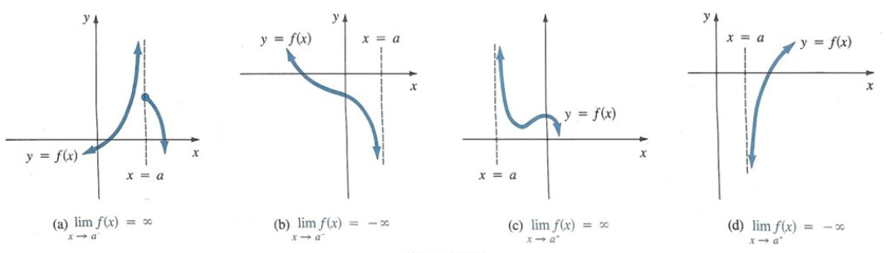

# Limits and Continuity {#sec-limits}

::: {.epigraph}
A man has one hundred dollars and you leave him with two dollars. That's subtraction.

[— Mae West]{.epigraph-by}
:::

The single most important idea in calculus is the idea of limit. More than $2000$ years ago, the ancient Greeks wrestled with the limit concept, and they did not succeed. It is only in the past $200$ years that we have finally come up with a firm understanding of limits. The study of calculus went through several periods of increased mathematical rigour beginning with the French mathematician Augustin-Loius Cauchy (1789-1857) and later continued by the German mathematician, and former high school teacher, Karl Wilhelm Weierstrass (1815-1897).

## Limit of a Function

If $f$ is a function, then we say $\displaystyle \lim _{x\rightarrow a}f(x)=A$, if the value of $f(x)$ gets arbitrarily closer to $A$ as $x$ gets closer and closer to $a$. For example, $\displaystyle \lim _{x\rightarrow 3} x^2=9$, since $x^2$ gets arbitrarily close to $9$ as $x$ approaches as close as one wishes to $3$.

The definition can be stated more precisely as follows : $\displaystyle \lim _{x\rightarrow a}f(x)=A$ if and only if, for any chosen positive number $\varepsilon$, however small, there exists a positive number $\delta$, such that, whenever $0<|x-a|<\delta$, then $|f(x)-A|<\varepsilon$.

$\displaystyle \lim _{x\rightarrow a}f(x)=A$ means that $f(x)$ can be made as close as desired to $A$ by making $x$ close enough, but not equal to $a$. How close is "close enough to $a$" depends on how close one wants to make $f(x)$ to $A$. It also of course depends on which function $f$ is and on which number $a$ is. The positive number $\varepsilon$ is how close one wants to make $f(x)$ to $A$ ; one wants the distance to be no more then $\varepsilon$. The positive number $\delta$ is how close one will make $x$ to $a$ ; if the distance from $x$ to $a$ is less than $\delta$ (but not zero), then the distance from $f(x)$ to $A$ will be less than $\varepsilon$. Thus $\delta$ depends on $\varepsilon$. The limit statement means that no matter how small $\varepsilon$ is made, $\delta$ can be made smaller enough. The letters $\varepsilon$ and $\delta$ can be understood as "error" and "distance". In these terms the error ($\varepsilon$) can be made as small as desired by reducing the distance ($\delta$).

#### [The $\varepsilon - \delta$ definition of $\displaystyle \lim _{x\rightarrow a}f(x)=A$]{.underline}

For any chosen positive number $\varepsilon$, however small, there exists a positive number $\delta$, such that, whenever $0<|x-a|<\delta$, then $|f(x)-A|<\varepsilon$.

**Example:** Show that $\displaystyle \lim _{n\rightarrow 1}(x^2+1)=2$.

**Solution:** Need to find $\delta$ so that, for a given $\varepsilon$, $|x^2+1-2|<\varepsilon$ for $|x-1|<\delta$.

Now $$\begin{aligned}
x^2+1-2 &=  x^2-1 \\
 &=  (x+1)(x-1).
 \end{aligned}$$ Choose $|x-1|<1$ so that $-1<x-1<1\Rightarrow 0<x<2\Rightarrow 1<x+1<3$. You have $|x^2+1-2|<\varepsilon$ if $3|x-1|<\varepsilon$ or $|x-1|<\dfrac{\varepsilon}{3}$. You have now two conditions on $x$ : $$|x-1|<1 \quad \text{and} \quad |x-1|<\frac{\varepsilon}{3}.$$ Choose $\delta =\min \{1,\frac{\varepsilon}{3}\}$. For a given $\varepsilon >0$, choose $\delta =\min \{1,\frac{\varepsilon}{3}\}$, then we have $|x-1|<\delta$, it would be true that $|x^2+1-2|<\varepsilon$.

**Example:** Show that $\displaystyle \lim _{x\rightarrow 2} (x^2+3x)=10$.

**Solution:** Let $\varepsilon >0$. We must produce a $\delta >0$ such that, whenever $0<|x-2|<\delta$ then $|(x^2+3x)-10|<\varepsilon$. First we note that $$|(x^2+3x)-10|=|(x-2)^2+7(x-2)| \leq |x-2|^2 +7|x-2|.$$ Also, if $0<\delta \leq 1$, then $\delta ^2 \leq \delta$. Hence, if we take $\delta$ to be the minimum of $1$ and $\dfrac{\varepsilon}{8}$, then, whenever $0<|x-2|<\delta$, $$|(x^2+3x)-10|<\delta ^2 +7\delta \leq \delta +7\delta =8\delta \leq \varepsilon .$$ **You Try It:** Prove that $\displaystyle \lim _{x\rightarrow 0}x\sin \left(\frac{1}{x}\right)=0$.

#### Right and Left Limits

Considering $x$ and $a$ as points on the real axis where $a$ is fixed and $x$ is moving, then $x$ can approach $a$ from the right or from the left. We indicate these respective approaches by writing $x\rightarrow a^+$ and $x\rightarrow a^-$.

If $\displaystyle \lim _{x\rightarrow a^+} f(x)=A_1$ and $\displaystyle \lim _{x\rightarrow a^-} f(x)=A_2$, we call $A_1$ and $A_2$ respectively the *right* and *left* hand limits of $f(x)$ at $a$.

We have $\displaystyle \lim _{x\rightarrow a} f(x)=A$ if and only if $\displaystyle \lim _{x\rightarrow a^+} f(x)=\displaystyle \lim _{x\rightarrow a^-} f(x)=A$. The existence of the limit from the left does not imply the existence of the limit from the right and conversely. When a function $f$ is defined on only one side of a point $a$, then $\displaystyle \lim _{x\rightarrow a} f(x)$ is identical to the one-sided limit, if it exists. For example, if $f(x)=\sqrt{x}$, then $f$ is only defined to the right of zero. Hence, $\displaystyle \lim _{x\rightarrow 0}\sqrt{x}=\lim _{x\rightarrow 0^+}\sqrt{x}=0$. Of course, $\displaystyle \lim _{x\rightarrow 0^-}\sqrt{x}$ does not exist, since $\sqrt{x}$ is not defined when $x<0$. On the other hand, consider the function $g(x)=\sqrt{\dfrac{1}{x}}$, which is defined only for $x>0$. In this case, $\displaystyle \lim _{x\rightarrow 0^+} g(x)$ does not exist and, therefore $\displaystyle \lim _{x\rightarrow 0} g(x)$ does not exist.

## Theorems on Limits

1.  If $f(x)=c$, a constant, then $\displaystyle \lim _{x\rightarrow a} f(x)=c$.

2.  If $\displaystyle \lim _{x\rightarrow a} f(x)=A$ and $\displaystyle \lim _{x\rightarrow a} g(x)=B$, then

    1.  $\displaystyle \lim _{x\rightarrow a} kf(x)=kA$, $k$ being any constant.

    2.  $\displaystyle \lim _{x\rightarrow a} [f(x)\pm g(x)]=\displaystyle \lim _{x\rightarrow a} f(x) \pm \displaystyle \lim _{x\rightarrow a} g(x)=A\pm B$.

    3.  $\displaystyle \lim _{x\rightarrow a} f(x)g(x)=\displaystyle \lim _{x\rightarrow a} f(x)\displaystyle \lim _{x\rightarrow a} g(x)=AB$.

    4.  $\displaystyle \lim _{x\rightarrow a} \dfrac{f(x)}{g(x)}=\dfrac{\displaystyle \lim _{x\rightarrow a} f(x)}{\displaystyle \lim _{x\rightarrow a} g(x)}=\dfrac{A}{B}$, provided $B\neq 0$.

**Example:** If $\displaystyle \lim _{x\rightarrow a} f(x)$ exists, prove that it must be unique.

**Solution:** Must show that if $\displaystyle \lim _{x\rightarrow a} f(x)=A_1$ and $\displaystyle \lim _{x\rightarrow a} f(x)=A_2$, then $A_1=A_2$.

By hypothesis, given any $\varepsilon >0$ we can find $\delta >0$ such that $$\begin{aligned}
|f(x)-A_1|<\frac{\varepsilon}{2} \quad \text{when} \quad 0<|x-a|<\delta\\
|f(x)-A_2|<\frac{\varepsilon}{2} \quad \text{when} \quad 0<|x-a|<\delta .
\end{aligned}$$ Then $$|A_1-A_2|=|A_1-f(x)+f(x)-A_2| \leq |A_1-f(x)| +|f(x)-A_2|<\frac{\varepsilon}{2} +\frac{\varepsilon}{2}=\varepsilon .$$ i.e., $|A_1-A_2|$ is less than any positive number $\varepsilon$ (however small) and so must be zero. Thus $A_1=A_2$.

**Example:** Given $\displaystyle \lim _{x\rightarrow a} f(x)=A$ and $\displaystyle \lim _{x\rightarrow a} g(x)=B$. Prove that $$\displaystyle \lim _{x\rightarrow a} [f(x)+ g(x)]=\displaystyle \lim _{x\rightarrow a} f(x) + \displaystyle \lim _{x\rightarrow a} g(x)=A+ B$$.

**Solution:** We must show that for any $\varepsilon >0$, we can find $\delta >0$ such that $|(f(x)+g(x))-(A+B)|<\varepsilon$ when $0<|x-a|<\delta$.

By hypothesis, given $\varepsilon >0$, we can find $\delta _1 >0$ and $\delta _2 >0$ such that $$\begin{aligned}
|f(x)-A|<\frac{\varepsilon}{2} \quad \text{when} \quad 0<|x-a|<\delta _1\\
|g(x)-B|<\frac{\varepsilon}{2} \quad \text{when} \quad 0<|x-a|<\delta _2 .
\end{aligned}$$ Then $$|(f(x)+g(x))-(A+B)|\leq |f(x)-A| +|g(x)-B|<\frac{\varepsilon}{2} +\frac{\varepsilon}{2} =\varepsilon ,$$ when $0<|x-a|<\delta$ where $\delta$ is chosen as the smaller of $\delta _1$ and $\delta _2$.

**You Try It:** Given $\displaystyle \lim _{x\rightarrow a} f(x)=A$ and $\displaystyle \lim _{x\rightarrow a} g(x)=B$. Prove that $$\displaystyle \lim _{x\rightarrow a} f(x)g(x)=\displaystyle \lim _{x\rightarrow a} f(x)\displaystyle \lim _{x\rightarrow a} g(x)=AB$$.

## Special Limits

1.  $\displaystyle \lim _{x\rightarrow 0}\dfrac{\sin x}{x}=1$, $\displaystyle \lim _{x\rightarrow 0}\dfrac{1-\cos x}{x}=0$.

2.  $\displaystyle \lim _{x\rightarrow \infty}\left(1+\dfrac{1}{x}\right)^x=e$, $\displaystyle \lim _{x\rightarrow 0^+}(1+x)^{\frac{1}{x}}=e$.

3.  $\displaystyle \lim _{x\rightarrow 0}\dfrac{e^x-1}{x}=1$, $\displaystyle \lim _{x\rightarrow 1}\dfrac{x-1}{\ln x}=1$.

## Methods of Calculating $\displaystyle \lim _{x\rightarrow a} f(x)$

#### If $f(a)$ is defined

If $x=a$ is in the domain of $f(x)$ and $a$ is not an endpoint of the domain, and $f(x)$ is defined by a single expression, then $$\lim _{x\rightarrow a} f(x)= f(a).$$

**Example:** Find $\displaystyle \lim _{x\rightarrow 1} (x+3)$.

**Solution:** $\displaystyle \lim _{x\rightarrow 1}(x+3)=1+3=4$.

**Example:** Find $\displaystyle \lim _{x\rightarrow 1} \dfrac{1}{x+2}$.

**Solution:** $\displaystyle \lim _{x\rightarrow 1} \dfrac{1}{x+2} =\dfrac{1}{1+2}=\dfrac{1}{3}$.

**Example:** Find $\displaystyle \lim _{x\rightarrow 8} (x^2-7x+5)$.

**Solution:** $\displaystyle \lim _{x\rightarrow 8} (x^2-7x+5)=8^2-7(8)+5=13$.

**Example:** Find $\displaystyle \lim _{x\rightarrow 2} \dfrac{x^2-4}{x-2}$.

**Solution:** $\displaystyle \lim _{x\rightarrow 2} \dfrac{x^2-4}{x-2}= \lim _{x\rightarrow 2} \dfrac{(x+2)(x-2)}{x-2}=\lim _{x\rightarrow 2} (x+2)=4$.

#### Functions Defined By More Than One Expression

Suppose that $f(x)$ is defined by one expression for $x<a$ and by a different expression for $x>a$.

**Example:** Show that $\displaystyle \lim _{x\rightarrow 0}\dfrac{|x|}{x}$ does not exist.

**Solution:** Notice that $$\dfrac{|x|}{x} = \left\{ 
\begin{array}{l l}
  \dfrac{x}{x}=1, & \quad \text{if}~~~ x\geq 0 \\
 -\dfrac{x}{x}=-1, & \quad \text{if}~~~ x<0.\\ \end{array} \right.$$ i.e., you seek a limit at $x=0$ of a function that is defined differently on either side of $x=0$. $$\begin{aligned}
 \lim _{x\rightarrow 0^-}\dfrac{|x|}{x} &=  \lim _{x\rightarrow 0^-}(-1)=-1.\\
  \lim _{x\rightarrow 0^+}\dfrac{|x|}{x} &=  \lim _{x\rightarrow 0^+}(1)=1.
 \end{aligned}$$ Since $\displaystyle \lim _{x\rightarrow 0^+}\dfrac{|x|}{x} \neq  \lim _{x\rightarrow 0^-}\dfrac{|x|}{x}$, then $\displaystyle  \lim _{x\rightarrow 0}\dfrac{|x|}{x}$ does not exist.

**Example:** Find $\displaystyle \lim _{x\rightarrow 0}\dfrac{\sin 3x}{x}$.

**Solution:** Since $\dfrac{\sin 3x}{x}=3\left(\dfrac{\sin 3x}{3x}\right)$. Then $$\lim _{x\rightarrow 0}\dfrac{\sin 3x}{x}=\lim _{x\rightarrow 0} 3\left(\dfrac{\sin 3x}{3x}\right)=3\lim _{x\rightarrow 0}\dfrac{\sin 3x}{3x}=3(1)=3.$$

**Example:** Find $\displaystyle \lim _{x\rightarrow 0} \dfrac{1-\cos 2x}{\sin 3x}$.

**Solution:** Since $\dfrac{1-\cos 2x}{\sin 3x}=2x\left(\dfrac{1-\cos 2x}{2x}\right)\dfrac{3x}{\sin 3x}\left(\dfrac{1}{3x}\right)=\dfrac{2}{3}\left(\dfrac{1-\cos 2x}{2x}\right)\left(\dfrac{3x}{\sin 3x}\right)$. Then $$\lim _{x \rightarrow 0}\dfrac{1-\cos 2x}{\sin 3x}=\dfrac{2}{3}\left(\lim _{x\rightarrow 0}\left(\dfrac{1-\cos 2x}{2x}\right) \left( \lim _{x\rightarrow 0} \dfrac{3x}{\sin 3x}\right)\right)=\dfrac{2}{3} (0)(1)=0.$$

**Example:** Find $\displaystyle \lim _{x\rightarrow \frac{\pi}{4}}\dfrac{\sin x}{\cos x}$.

**Solution:** $\displaystyle \lim _{x\rightarrow \frac{\pi}{4}}\dfrac{\sin x}{\cos x} =\dfrac{\sin \left(\frac{\pi}{4}\right)}{\cos \left(\frac{\pi}{4}\right)}=1$.

**You Try It:** Show that $\displaystyle \lim _{\theta \rightarrow 0} \dfrac{1-\cos \theta}{\theta}=0$.

#### Limits at Infinity

It sometimes happen that as $x\rightarrow a$, $f(x)$ increases or decreases without bound. We write
$\displaystyle \lim _{x\rightarrow a}f(x)=+\infty$ or $\displaystyle \lim _{x\rightarrow a}f(x)=-\infty$. We say that, $\displaystyle \lim _{x\rightarrow a}f(x)=+\infty$, if for each positive number $M$ we can find a positive number $\delta$ (depending on $M$ in general) such that $f(x)>M$ whenever $0<|x-a|<\delta$.

Similarly, we say that $\displaystyle \lim _{x\rightarrow a}f(x)=-\infty$, if for each positive number $M$ we can find a positive number $\delta$ (depending on $M$ in general) such that $f(x)<-M$ whenever $0<|x-a|<\delta$.

{fig-align="center" width=620px}

Note that $\displaystyle \lim _{x\rightarrow \infty} \dfrac{1}{x}=0$ and $\displaystyle \lim _{x\rightarrow -\infty} \dfrac{1}{x}=0$.

#### Limits at Infinity of a Rational Function

A rational function is a quotient of two polynomials, $f(x)=\dfrac{p_m(x)}{q_n (x)}$, where $m$ and $n$ are the degrees of the two polynomials.

1.  **If** $m<n$, then $\displaystyle \lim _{x\rightarrow \infty}f(x)=0$.

    **Example:** Find $\displaystyle \lim _{x\rightarrow \infty}\dfrac{x+1}{x^2+4}$.
    **Solution:** The degree of the numerator is one, the degree of the denominator is two. Therefore $\displaystyle \lim _{x\rightarrow \infty}\dfrac{x+1}{x^2+4} =0$, since $\displaystyle \lim _{x\rightarrow \infty}\dfrac{\frac{1}{x}+\frac{1}{x^2}}{1+\frac{4}{x^2}}=\dfrac{0+0}{1+0} =0$.

2.  **If** $m>n$, then $\displaystyle \lim _{x\rightarrow \infty}f(x)=\pm \infty$ . (sign depends on the polynomials $p_m(x)$ and $q_n(x)$, if they are of the same sign as $x$ gets larger, the quotient is positive, if they are of opposite signs, the quotient is negative)

    **Example:** Find $\displaystyle \lim _{x\rightarrow \infty}\dfrac{x^3-2x^2+3x+4}{3x+5}$.
    **Solution:** $\displaystyle \lim _{x\rightarrow \infty}\dfrac{x^3-2x^2+3x+4}{3x+5}=\lim _{x\rightarrow \infty}\dfrac{1-\frac{2}{x}+\frac{3}{x^2}+\frac{4}{x^3}}{\frac{3}{x^2}+\frac{5}{x^3}}=\dfrac{1}{0}=\infty$.

3.  **If** $m=n$, then $\displaystyle \lim _{x\rightarrow \infty}f(x)=\dfrac{a}{b}$, where $a$ is the coefficient of $x^m$ in the numerator and $b$ is the coefficient of $x^n$ in the denominator.

    **Example:** Find $\displaystyle \lim _{x\rightarrow \infty}\dfrac{x^3-4x+1}{3x^3+2x+7}$.
    **Solution:** $\displaystyle \lim _{x\rightarrow \infty}\dfrac{x^3-4x+1}{3x^3+2x+7}=\lim _{x\rightarrow \infty} \dfrac{1-\frac{4}{x^2}+\frac{1}{x^3}}{3+\frac{2}{x^2}+\frac{7}{x^3}}=\dfrac{1-0+0}{3+0+0}=\dfrac{1}{3}$.
    **You Try It:** What is $\displaystyle \lim _{x\rightarrow \infty}\dfrac{a_0x^m+a_1x^{m-1}+\cdots + a_m}{b_0x^n+b_1x^{n-1}+\cdots +b_n}$, where $a_0, b_0 \neq 0$ and $m$ and $n$ are positive integers, when (a)  $m>n$ (b)  $m=n$ (c)  $m<n$.

    **You Try It:** Find $\displaystyle \lim _{x\rightarrow 4} \dfrac{x-4}{\sqrt{x}-2}$.

## Continuity

A function $f(x)$ is **continuous** at a point $x=a$ if

1.  $f(a)$ is defined.

2.  $\displaystyle \lim _{x\rightarrow a} f(x)$ exists.

3.  $\displaystyle \lim _{x\rightarrow a} f(x) =f(a)$.

Notice that, for $f(x)$ to be continuous at $x=a$, all three conditions must be satisfied. If at least one condition fails, $f$ is said to have a discontinuity at $x=a$. For example, $f(x)=x^2+1$ is continuous at $x=2$ since $\displaystyle \lim _{x\rightarrow 2} f(x)=5=f(2)$. The first condition above implies that a function can be continuous only at points of its domain. Thus, $f(x)=\sqrt{4-x^2}$ is not continuous at $x=3$ because $f(3)$ is imaginary, i.e., not defined.

A function $f$ is right-continuous (continuous from the right) at a point $x=a$ in its domain if $\displaystyle \lim _{x\rightarrow a^+}f(x)=f(a)$. It is left-continuous (continuous from the left) at $x=a$ if $\displaystyle \lim _{x\rightarrow a^-}f(x)=f(a)$. A function is continuous at an interior point $x=a$ of its domain if and only if it is both right-continuous and left-continuous at $x=a$.

**Example:** Determine whether $f(x)=x^2+1$ is continuous at $x=1$.

**Solution:** $\displaystyle \lim _{x\rightarrow 1} x^2+1=f(1)=1^2+1=2$. Therefore $f(x)=x^2+1$ is continuous at $x=1$.

**Example:** Determine whether $f(x)=\dfrac{|x|}{x}$ is continuous at $x=0$.

**Solution:** Since $f(0)$ is not defined, $f(x)$ is not continuous at $x=0$.

**Example:** Determine whether $$f(x)= \left\{ 
\begin{array}{l l}
  \dfrac{|x|}{x}, & \quad \text{if}~~~ x\neq 0 \\
 0, & \quad \text{if}~~~ x=0,\\ \end{array} \right.$$ is continuous at $x=0$.

**Solution:** $f(0)$ now defined. Then

Then $\displaystyle \lim _{x\rightarrow 0} f(x)$ must be considered in two steps, $$\begin{aligned}
 \lim _{x\rightarrow 0^-}f(x) &=  \lim _{x\rightarrow 0^-} (-1) = -1.\\
 \lim _{x\rightarrow 0^+}f(x) &=  \lim _{x\rightarrow 0^+} (1) = 1.
 \end{aligned}$$ Sine the limits are not the same, $\displaystyle \lim _{x\rightarrow 0} f(x)$ does not exist and $f(x)$ is not continuous at $x=0$.

**You Try It:** Determine whether the function defined by $$f(x) = \left\{ 
\begin{array}{l l}
  x^2, & \quad \text{if}~~~ x<2 \\
  5, & \quad \text{if}~~~x=2\\
 -x+6, & \quad \text{if}~~~ x>2,\\ \end{array} \right.$$ is continuous at the point $x=2$.

A function $f(x)$ is **discontinuous** at $x=a$ if one or more of the conditions for continuity fails there.

**Example:** (a)  $f(x)=\dfrac{1}{x-2}$ is discontinuous at $x=2$, because $f(2)$ is not defined (has a zero denominator) and because $\displaystyle \lim _{x\rightarrow 2}f(x)$ does not exist (equals $\infty$). The function is, however, continuous everywhere except at $x=2$, where it is said to have an *infinite discontinuity*.

(b)  $f(x)=\dfrac{x^2-4}{x-2}$ is discontinuous at $x=2$ because $f(2)$ is not defined (both numerator and denominator are zero) and because $\displaystyle \lim _{x\rightarrow 2}f(x)=4$. The discontinuity here is called *removable* since it may be removed by redefining the function as $f(x)=\dfrac{x^2-4}{x-2}$ for $x\neq 2$ and $f(2)=4$. (Note the discontinuity in (a) cannot be removed because the limit also does not exist.)

## The $\varepsilon - \delta$ Definition of Continuity

$f(x)$ is continuous at $x=a$, if for any $\varepsilon >0$, we can find $\delta >0$, such that, $|f(x)-f(a)|<\varepsilon$ whenever $0<|x-a|<\delta$.

**Example:** Prove that $f(x)=x^2$ is continuous at $x=2$.

**Solution:** Must show that, given any $\varepsilon >0$, we can find $\delta>0$, such that $|f(x)-f(2)|=|x^2-4|<\varepsilon$ when $|x-2|<\delta$.

Choose $\delta \leq 1$, so that $|x-2|<1$ or $1<x<3$ ($x\neq 2$). Then $|x^2-4|=|(x-2)(x+2)|=|x-2||x+2| <\delta|x+2|<5\delta$. Taking $\delta =\min \{1, \frac{\varepsilon}{5}\}$ whichever is smaller, then we have $|x^2-4|<\varepsilon$ whenever $|x-2|<\delta$.

**You Try It:** (a)  Prove that $f(x)=x$ is continuous at any point $x=x_0$.
(b)  Prove that $f(x)=2x^3+x$ is continuous at any point $x=x_0$.

#### Theorems on Continuity

1.  Theorem $1$. If $f(x)$ and $g(x)$ are continuous at $x=a$, so are the functions $f(x) \pm g(x), \, f(x)g(x)$ and $\dfrac{f(x)}{g(x)}$ if $g(x) \neq 0$.

2.  Theorem $2$. The following functions are continuous in every finite interval (a)  all polynomials (b)  $\sin x$ and $\cos x$ (c)  $a^x, a>0$.

3.  Theorem $3$. If $y=f(x)$ is continuous at $x=a$ and $z=g(y)$ is continuous at $y=b$ and if $b=f(a)$, then the function $z=g[f(x)]$ called a function of a function or composite function is continuous at $x=a$.

    **Briefly:** A continuous function of a continuous function is continuous.

4.  Theorem $4$. If $f(x)$ is continuous in a closed interval, it is bounded in the interval.

**You Try It:** Suppose that $f(x)\leq g(x)\leq h(x)$ for all $x$ in an open interval containing $a$ and $\displaystyle \lim _{x\rightarrow a}f(x)=\lim _{x\rightarrow a}h(x)=L$. Then, show that $\displaystyle \lim _{x\rightarrow a}g(x)=L$.

## Tutorial questions {.unnumbered}

::: {.tutorial}

1.  Let $$f(x) = \left\{ 
    \begin{array}{l l}
      3x-1, & \quad x< 0\\
      0, & \quad x=0\\
      2x+5, & \quad x >0,\\ \end{array} \right.$$ Evaluate (i)  $\displaystyle \lim _{x\rightarrow 2}f(x)$ (ii)  $\displaystyle \lim _{x\rightarrow -3}f(x)$ (iii)  $\displaystyle \lim _{x\rightarrow 0^+}f(x)$ (iv)  $\displaystyle \lim _{x\rightarrow 0^-}f(x)$ (v)  $\displaystyle \lim _{x\rightarrow 0}f(x)$.

2.  If $f(x)=\dfrac{3x+|x|}{7x-5|x|}$. Evaluate (i)  $\displaystyle \lim _{x\rightarrow \infty}f(x)$ (ii) $\displaystyle \lim _{x\rightarrow -\infty}f(x)$ (iii)  $\displaystyle \lim _{x\rightarrow 0^+}f(x)$
    (iv)  $\displaystyle \lim _{x\rightarrow 0^-}f(x)$ (v)  $\displaystyle \lim _{x\rightarrow 0}f(x)$

3.  Use the theorems on limits to evaluate each of the following limits.
    (i)  $\displaystyle \lim _{x\rightarrow 0}\dfrac{x^3-8}{x-2}$ (ii)  $\displaystyle \lim _{x\rightarrow 0}{\dfrac{\sqrt{3+x}-\sqrt{3}}{{x}}}$ (iii)  $\displaystyle \lim _{x\rightarrow \infty}{\dfrac{8x^2+4}{2x^2-x+2}}$ (iv)  $\displaystyle \lim _{x\rightarrow 2}{(4x^2-x+5)}$
    (v)  $\displaystyle \lim _{x \rightarrow 0}{\dfrac{\sqrt{x+4}-2}{x}}$ (vi)  $\displaystyle \lim _{x\rightarrow \infty}{\dfrac{a_0+a_1x+\cdots +a_mx^m}{b_0+b_1x+\cdots +b_nx^n}}$ (vii)  $\displaystyle \lim _{x\rightarrow \infty}{\dfrac{(3x-1)(2x+3)}{(5x-3)(4x+5)}}$
    (viii)  $\displaystyle \lim _{x\rightarrow  0}{\dfrac{\sin 3x}{x}}$ (ix)  $\displaystyle \lim _{x\rightarrow 0}{\dfrac{6x-\sin 2x}{2x+3\sin 4x}}$ (x)  $\displaystyle \lim _{x\rightarrow 0}{\dfrac{\sin x}{\sin 2x}}$ (xi)  $\displaystyle \lim _{x\rightarrow 4}{\dfrac{2x-8\sqrt{x}+8}{\sqrt{x}-2}}$.

4.  For $f(x)=5x-6$, find a $\delta >0$ such that whenever $0<|x-4|<\delta$, then $|f(x)-14|<\varepsilon$ when (i)  $\varepsilon =\frac{1}{2}$ (ii)  $\varepsilon =0.001$.

5.  Verify (i)  $\displaystyle \lim _{x\rightarrow 2}\dfrac{x^2-4}{x-2}=4$ (ii)  $\displaystyle \lim _{x\rightarrow 0}x^2 \cos \left(\frac{1}{x}\right)=0$.

6.  Give the points of discontinuity of each of the following functions.
    (i)  $f(x)=\dfrac{x}{(x-2)(x-4)}$ (ii)  $f(x)=x^2\sin \left(\frac{1}{x}\right), f(0)=0$
    (iii)  $f(x)=\sqrt{(x-3)(6-x)}, 3 \leq x\leq 6$ (iv)  $f(x)=\dfrac{1}{1+2\sin x}$.

7.  For what values of $x$ in the domain of definition is each of the following functions continuous?
    (i)  $f(x)=\dfrac{x}{x^2-1}$ (ii)  $f(x)=\dfrac{1+\cos x}{3+\sin x }$ (iii)  $f(x)=10^{-\frac{1}{(x-3)^2}}$
    (iv)  $f(x)=\dfrac{x-|x|}{x}$.

8.  Given that the function $f:\mathbb{R} \to \mathbb{R}$ be defined by $$f(x) = \left\{ 
    \begin{array}{l l}
      x^2-4, & \quad x \geq 2\\
      2ax+b, & \quad 0<x<2\\
      e^x, & \quad x\leq 0,\\ \end{array} \right.$$ is continuous at all points in $\mathbb{R}$. Find the values of $a$ and $b$.

9.  Find the values of $a$ and $b$ such that the function $f$ will be continuous on $\mathbb{R}$ $$f(x) = \left\{ 
    \begin{array}{l l}
      ax-3, & \quad x< 2\\
      3-x-2x^2, & \quad 2\leq x \leq 4\\
      bx+7, & \quad x >4.\\ \end{array} \right.$$

10. Determine all values of the the constant $A$ so that the following is continuous for all values of $x$, $$f(x) = \left\{ 
    \begin{array}{l l}
      A^2x-A, & \quad x \geq 3\\
      4, & \quad x <3.\\ \end{array} \right.$$

11. Determine all the values of the constants $A$ and $B$ so that the following is continuous for all values of $x$, $$f(x) = \left\{ 
    \begin{array}{l l}
      Ax-B, & \quad x\leq -1\\
      2x^2+3Ax+B, & \quad -1<x\leq 1\\
      4, & \quad x >1.\\ \end{array} \right.$$

12. The function $f:\mathbb{R} \to \mathbb{R}$ is defined by $$f(x) = \left\{ 
    \begin{array}{l l}
     \sin x, & \quad x\leq 0\\
      ax+b, & \quad 0<x \leq 3\\
      x^3, & \quad x >3.\\ \end{array} \right.$$ Find all the values of $a$ and $b$ if $f$ is continuous on $\mathbb{R}$.

13. Let $f:\mathbb{R} \to \mathbb{R}$ be the function defined by $$f(x) = \left\{ 
    \begin{array}{l l}
      x^2, & \quad x\geq 2\\
      ax+b, & \quad 1<x<2\\
      2-x, & \quad x\leq 1,\\ \end{array} \right.$$ where $a$ and $b$ are constants. If $f$ is continuous on $\mathbb{R}$, find the values $a$ and $b$.

:::
