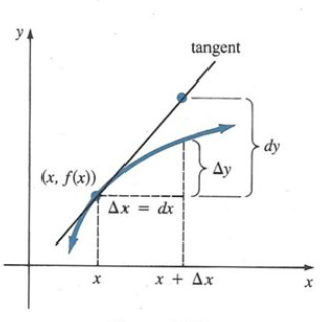
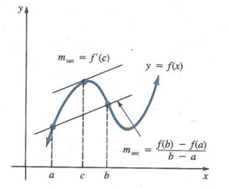
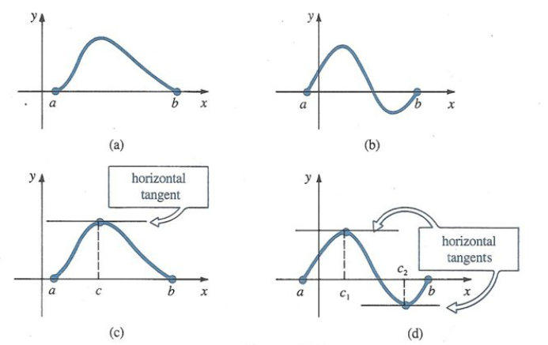
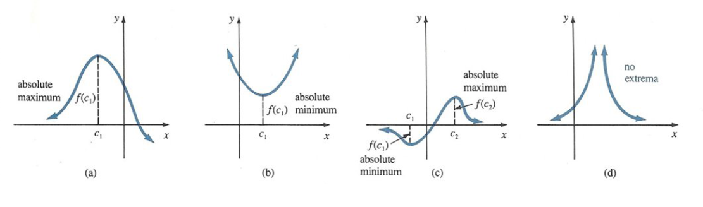
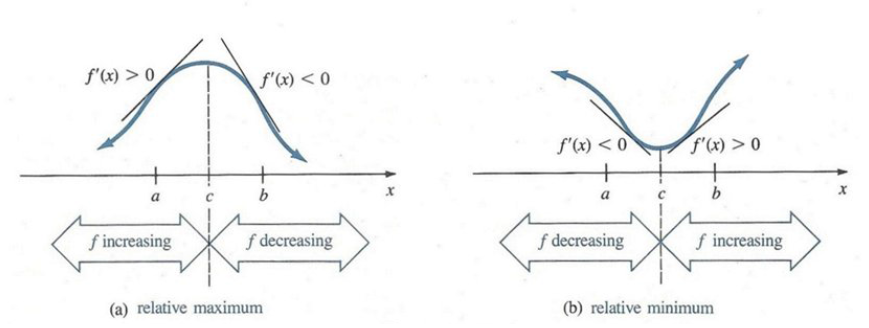
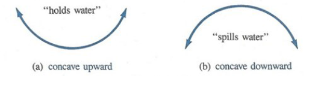
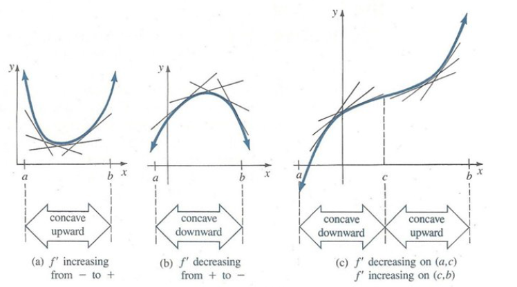
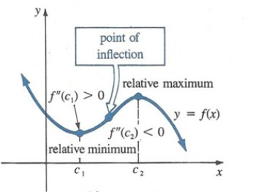

# Applications of the Derivative {#sec-applications}

::: {.epigraph}
Gravitation cannot be held responsible for people falling in love. How on earth can you explain in terms of chemistry and physics so important a biological phenomenon as first love? Put your hand on a stove for a minute and it seems like an hour. Sit with that special girl for an hour and it seems like a minute. That's relativity.

[— Albert Einstein]{.epigraph-by}
:::

## Approximation by Differentials

A method for approximating the value of a function near a known value. The method uses the tangent line at a known value of the function to approximate the function's graph. Let $\Delta x$ and $\Delta y$ represent the changes in $x$ and $y$ for the function and $dx$ and $dy$ represents the changes in $x$ and $y$ for the tangent line.

{fig-align="center" width=328px}

This is also written as $$f(x+\Delta x)=f(x)+\Delta y =f(x)+f'(x)\Delta x.$$

**Example:** Approximate $\sqrt{10}$ by differentials.

**Solution:** $\sqrt{10}$ is near $\sqrt{9}$, so we will use $f(x)=\sqrt{x}$ with $x=9$ and $\Delta x =10-9=1$. Note that $f'(x)=\dfrac{1}{2\sqrt{x}}$. Therefore $$\begin{aligned}
\sqrt{10} &=  f(x+\Delta x)\\
&\approx  f(x)+ f'(x)\Delta x\\
&=  \sqrt{x} +\dfrac{1}{2\sqrt{x}}\Delta x =\sqrt{9} +\dfrac{1}{2\sqrt{9}} (1)\\
&=  \dfrac{19}{6}.
\end{aligned}$$ **Example:** Find an approximate value of $\sqrt[3]{9}$.

**Solution:** We set $f(x)=\sqrt[3]{x}$. Suppose to find $f(9)$. Note that $f'(x)=\frac{1}{3}x^{-\frac{2}{3}}$ and hence, $f(8)=2$ and $f'(8)=\frac{1}{12}$, where $x=8$ and $\Delta x =9-8=1$. Therefore, $$\begin{aligned}
\sqrt[3]{9} &=  f(9) \approx 2+\dfrac{1}{12} (1)\\
&=  \dfrac{25}{12}\\
&\approx  2.0833.
\end{aligned}$$ **Example:** Find an approximate value for $\tan 46^\circ$.

**Solution:** Radial measure $46^\circ =45^\circ +1^\circ$ corresponds to $\dfrac{\pi}{4} +\dfrac{\pi}{180}$ and note that $f(x)=\tan x$, then $f'(x)=\sec ^2 x$ and $f(\frac{\pi}{4})=1, \, f'(\frac{\pi}{4})=2$. Therefore $$\tan 46^\circ = \tan \left(\dfrac{\pi}{4}+\dfrac{\pi}{180}\right) \approx \tan \frac{\pi}{4} +\sec ^2 \frac{\pi}{4} \left(\dfrac{\pi}{180}\right) = 1+\dfrac{\pi}{90} \approx 1.0349.$$

## The Mean Value Theorem

Suppose $f(x)$ is continuous on $[a,b]$ and differentiable on $(a,b)$. Then, there exists a $c$ in $(a,b)$ at which the tangent line is parallel to the secant line joining the points $(a,f(a))$ and $(b,f(b))$, i.e., at which $f'(c)=\dfrac{f(b)-f(a)}{b-a}$,

**OR**
If $f(x)$ is continuous in $[a,b]$ and differentiable in $(a,b)$, then there exists a point $c$ in $(a,b)$ such that $$f'(c)=\dfrac{f(b)-f(a)}{b-a}, \quad a<c<b.$$

{fig-align="center" width=380px}

The word **mean** in The Mean Value Theorem refers to the mean (or average) rate of change of $f$ in the interval $[a,b]$.

If $f(a)=f(b)=0$, then the theorem says that there exists a $c$ in $(a,b)$ at which $f'(c)=0$. The graphs suggest that there must be at least one point on the graph, that corresponds to a number $c$ in $(a,b)$, at which the tangent is horizontal. This special case of the Mean Value Theorem is called **Rolle's Theorem** [^1].

{fig-align="center" width=620px}

**Example:** Consider $f(x)=\sqrt{x-1}$ on $[2,5]$, $f(x)$ is continuous when $x-1\geq 0$, i.e., $x\geq 1$. In particular, $f(x)$ is continuous on $[2,5]$ and $f'(x)=\dfrac{1}{2\sqrt{x-1}}$, so differentiable when $x>1$. In particular, $f(x)$ is differentiable on $(2,5)$. $$\dfrac{f(b)-f(a)}{b-a} =\dfrac{f(5)-f(2)}{5-2} =\dfrac{\sqrt{5-1}-\sqrt{2-1}}{3}=\dfrac{1}{3}.$$ The Mean Value Theorem asserts that, for some $c$ in $(2,5), \, f'(c)=\dfrac{1}{3}$. Let us find it. $$\begin{aligned}
f'(x) &= \dfrac{1}{3}\\
\dfrac{1}{2\sqrt{x-1}} &= \dfrac{1}{3}\\
2\sqrt{x-1} &=  3\\
4(x-1) &=  9\\
x-1 &= \dfrac{9}{4}\\
x &=  \dfrac{13}{4}.
\end{aligned}$$ Notice that $\dfrac{13}{4}$ is in $(2,5)$, so we may take $c=\dfrac{13}{4}$.

**Example:** Show that if $f(x)=\tan x$ on the interval $0\leq x\leq k$ where $k<\dfrac{\pi}{2}$, then $\tan k \geq k$.

**Solution:** By the Mean Value Theorem $$\dfrac{\tan k -\tan 0}{k-0} =\sec ^2 c,$$ for some $c\in (0,k)$. But $\sec ^2 c \geq 1$ and $\tan 0 =0$. So $$\dfrac{\tan k}{k} \geq 1 \Longrightarrow \tan k \geq k.$$

**Example:** Use The Mean Value Theorem to show that $|\cos a -\cos b|\leq |a-b|$.

**Solution:** The function $\cos x$ is continuous and differentiable for all $x$. By the Mean Value Theorem $$\begin{aligned}
 (\cos x)' &=  \dfrac{\cos a -\cos b}{a-b}\\
 |(\cos x)'| &=  \left|\dfrac{\cos a -\cos b}{a-b} \right|,
 \end{aligned}$$ but $(\cos x)'=-\sin x$ and $|(\cos x)'|\leq 1$, therefore $$\dfrac{|\cos a -\cos b|}{|a-b|}\leq 1 \Longrightarrow |\cos a -\cos b|\leq |a-b|.$$

**Example:** Prove that $\dfrac{b-a}{1+b^2}<\tan ^{-1} b -\tan ^{-1} a < \dfrac{b-a}{1+a^2}$ for $a<b$.

**Solution:** Let $f(x)=\tan ^{-1} x$. Since $f'(x)=\dfrac{1}{1+x^2}, \,f'(c)=\dfrac{1}{1+c^2}$. By the Mean Value Theorem $$\dfrac{f(b)-f(a)}{b-a}=\dfrac{\tan ^{-1} b-\tan ^{-1} a}{b-a} =\dfrac{1}{1+c^2}, \quad a<c<b.$$ Then, from $a<c<b$, we have $$\begin{aligned}
 a^2<c^2<b^2 &\Longrightarrow& 1+a^2<1+c^2<1+b^2\\
 \dfrac{1}{1+a^2}>\dfrac{1}{1+c^2}>\dfrac{1}{1+b^2} &\Longrightarrow &  \dfrac{1}{1+b^2}<\dfrac{1}{1+c^2}<\dfrac{1}{1+a^2}\\
 \dfrac{1}{1+b^2}<\dfrac{\tan ^{-1} b -\tan ^{-1} a}{b-a} <\dfrac{1}{1+a^2} &\Longrightarrow & \dfrac{b-a}{1+b^2}<\tan ^{-1} b -\tan ^{-1} a < \dfrac{b-a}{1+a^2}.
 \end{aligned}$$

**Example:** Use the Mean Value Theorem, to prove that if $0<a<b$, then $1-\dfrac{a}{b}<\ln \left(\dfrac{b}{a}\right)<\dfrac{b}{a}-1$. Hence show that $\dfrac{1}{6}<\ln 1.2 < \dfrac{1}{5}$.

**Solution:** Let $f(x)=\ln x$ and $f'(x)=\dfrac{1}{x}$. By the Mean Value Theorem, there exists $c\in (a,b)$ such that $$f'(c)=\dfrac{1}{c}=\dfrac{\ln b -\ln a}{b-a}.$$ Then, from $a<c<b$ we have $$\begin{aligned}
 a<c<b  &\Longrightarrow & \dfrac{1}{b}< \dfrac{1}{c} <\dfrac{1}{a} \\
 \dfrac{1}{b} <\dfrac{\ln b -\ln a}{b-a} <\dfrac{1}{a} &\Longrightarrow & \dfrac{b-a}{b}<\ln b -\ln a < \dfrac{b-a}{a}\\
 &\Longrightarrow & 1-\dfrac{a}{b}<\ln \left(\dfrac{b}{a}\right)<\dfrac{b}{a}-1.
 \end{aligned}$$

Now, $\ln (1.2)=\ln \left(\dfrac{12}{10}\right)=\ln \left(\dfrac{6}{5} \right)$. Therefore $a=5$ and $b=6$. Substituting in
$1-\dfrac{a}{b}<\ln \left(\dfrac{b}{a}\right)<\dfrac{b}{a}-1$, we have $$1-\dfrac{5}{6}<\ln \left(\dfrac{6}{5}\right)<\dfrac{6}{5}-1 \Longrightarrow \dfrac{1}{6}<\ln 1.2 < \dfrac{1}{5}.$$

## Some Corollaries of The Mean Value Theorem

::: {#cor-applications-of-the-derivative-1}

If $f'(x)=0$ at all points of the interval $(a,b)$, then $f(x)$ must be a constant in the interval.

:::

::: {.proof}

Let $x_1<x_2$ be any two different points in $(a,b)$. By the Mean Value Theorem for
$x_1<x<x_2$, $$\dfrac{f(x_2)-f(x_1)}{x_2-x_1} =f'(x)=0.$$ Thus $f(x_1)=f(x_2)$. Since $x_1$ and $x_2$ are arbitrarily chosen, the function $f(x)$ has the same value at all points in the interval. Thus, $f(x)$ is constant.

:::

::: {#cor-applications-of-the-derivative-2}

If $f'(x)>0$ at all points of the interval $(a,b)$, then $f(x)$ is strictly increasing.

:::

::: {.proof}

Let $x_1<x_2$ be any two different points in $(a,b)$. By the Mean Value Theorem for
$x_1<x<x_2$, $$\dfrac{f(x_2)-f(x_1)}{x_2-x_1} =f'(x)>0.$$ Thus $f(x_2)>f(x_1)$ for $x_2>x_1$ and so $f(x)$ is strictly increasing.

:::

## Indeterminate Forms

Happens when $\displaystyle \lim _{x\rightarrow a} \dfrac{f(x)}{g(x)}$ tends to $\dfrac{0}{0}$ or $\dfrac{\infty}{\infty}$ as $x\rightarrow a$. Think of the situation $\displaystyle \lim _{x\rightarrow a} \dfrac{f(x)}{g(x)}\rightarrow \dfrac{0}{0}$ where $f(x)$ and $g(x)$ are differentiable (and therefore continuous so $f(a)=\displaystyle \lim _{x\rightarrow a} f(x)=0$ and $g(a)=\displaystyle \lim _{x\rightarrow a}g(x)=0$.), then $$\begin{aligned}
\lim _{x\rightarrow a} \dfrac{f(x)}{g(x)} &=  \lim _{x\rightarrow a} \dfrac{f(x)-f(a)}{g(x)-g(x)}\\
&=  \lim _{x\rightarrow a} \dfrac{\dfrac{f(x)-f(a)}{x-a}}{\dfrac{g(x)-g(a)}{x-a}} \quad \text{(provided the denominator is not zero)}\\
&=  \dfrac{\displaystyle \lim _{x\rightarrow a}\dfrac{f(x)-f(a)}{x-a}}{\displaystyle \lim _{x\rightarrow a}\dfrac{g(x)-g(a)}{x-a}}\\
&=  \dfrac{f'(a)}{g'(a)} =\dfrac{\displaystyle \lim _{x\rightarrow a} f'(x)}{\displaystyle \lim _{x\rightarrow a} g'(x)} \quad \text{(provided $f'(x)$ and $g'(x)$ are also continuous.)}
\end{aligned}$$

**Example:** $$\lim _{x\rightarrow 2} \dfrac{x^2-4}{x-2} =\lim _{x\rightarrow 2} \dfrac{(x^2-4)'}{(x-2)'}=\lim _{x\rightarrow 2} \dfrac{2x}{1}=2\cdot 2 =4.$$

::: {#thm-applications-of-the-derivative-1}

If $\displaystyle \lim  \dfrac{f(x)}{g(x)}=\lim \dfrac{f'(x)}{g'(x)}$ provided that $\displaystyle \lim \dfrac{f(x)}{g(x)}$ is of the type $\dfrac{0}{0}$ or $\dfrac{\infty}{\infty}$, this is called **L'H$\hat{o}$pital's Rule**: if either $\displaystyle \lim \dfrac{f(x) }{g(x)}=\dfrac{0}{0}$ or $\dfrac{\infty}{\infty}$.

:::

**Examples:** (a)  $\displaystyle \lim _{x\rightarrow 0}\dfrac{\sin 2x}{\sin 5x}=\lim _{x\rightarrow 0}\dfrac{2\cos 2x}{5\cos 5x}=\dfrac{2\cdot 1}{5\cdot 1}=\dfrac{2}{5}$.
(b)  $\displaystyle \lim _{x\rightarrow \infty} \dfrac{e^{3x}}{x}=\lim _{x\rightarrow \infty} \dfrac{3e^{3x}}{1}=\infty$.
(c)  $\displaystyle \lim _{x\rightarrow 0} \dfrac{e^x-1}{x^3}=\lim _{x \rightarrow 0} \dfrac{e^x}{3x^2}=\infty$.

**The form $\infty -\infty$.** A given limit that is not immediately $\dfrac{0}{0}$ or $\dfrac{\infty}{\infty}$ can be converted to one of these forms by combination of algebra and a little cleverness.

**Example:** Evaluate $\displaystyle \lim _{x\rightarrow 0} \left[\dfrac{1+3x}{\sin x}-\dfrac{1}{x}\right]$.

**Solution:** We note $\dfrac{1+3x}{\sin x}\rightarrow \infty$ and $\dfrac{1}{x}\rightarrow \infty$. However, after writing the difference as a single fraction, we recognize the form $\dfrac{0}{0}$. $$\begin{aligned}
\lim _{x\rightarrow 0} \left[\dfrac{1+3x}{\sin x}-\dfrac{1}{x}\right] &=  \lim _{x\rightarrow 0} \dfrac{3x^2+x-\sin x}{x\sin x}\\
&=  \lim _{x\rightarrow 0} \dfrac{6x+1-\cos x}{x\cos x +\sin x}\\
&=  \lim _{x\rightarrow 0} \dfrac{6+\sin x}{-x\sin x +2\cos x } \\
&=  \dfrac{6+0}{0+2} =3.
\end{aligned}$$

**The form $0\cdot \infty$.** By suitable manipulation, L'H$\hat{o}$pital's Rule can sometimes be applied to the limit form $0\cdot \infty$.

**Example:** Evaluate $\displaystyle \lim _{x\rightarrow \infty} x\sin \left(\dfrac{1}{x}\right)$.

**Solution:** Write the given expression as $$\lim _{x\rightarrow \infty} \dfrac{\sin \left(\dfrac{1}{x}\right)}{\dfrac{1}{x} }$$ and recognize that we have the form $\dfrac{0}{0}$. Hence, $$\begin{aligned}
\lim _{x\rightarrow \infty} x\sin \left(\dfrac{1}{x}\right) &=  \lim _{x\rightarrow \infty}\dfrac{(-x^{-2}\cos \frac{1}{x})}{(-x^{-2})}\\
&=  \lim _{x\rightarrow \infty} \cos \frac{1}{x} =1.
\end{aligned}$$

**The form $0^0, \, \infty ^0, \, 1^\infty$.** Suppose $y=f(x)^{g(x)}$ tends towards $0^0, \, \infty ^0, \, 1^\infty$ as $x\rightarrow a$ or $x\rightarrow \infty$. By taking the natural logarithm of $y$ ; $$\ln y=\ln f(x)^{g(x)} =g(x)\ln f(x)$$ and we see $$\lim _{x\rightarrow a} \ln y =\lim _{x\rightarrow a} g(x)\ln f(x)$$ is of the form $0\cdot \infty$. If it is assumed that $\displaystyle \lim _{x\rightarrow a} \ln y =\ln (\lim _{x\rightarrow a} y)=L$, then $\displaystyle \lim _{x\rightarrow a}= e^L$ or $$\lim _{x\rightarrow a} f(x)^{g(x)} =e^L.$$

**Example:** Evaluate $\displaystyle \lim _{x\rightarrow 0^+} x^{\frac{1}{\ln x}}$.

**Solution:** The form is $0^0$. Now, if we set $y=x^{\frac{1}{\ln x}}$, then $$\ln y= \dfrac{1}{\ln x} \ln x =1.$$ Notice we do not need L'H$\hat{o}$pital's Rule in this case since $$\lim _{x\rightarrow 0^+} \ln y =1.$$ Hence, $\displaystyle \lim _{x\rightarrow 0^+}y =e^1$ or equivalently $\displaystyle \lim _{x\rightarrow 0^+}x^{\frac{1}{\ln x}}=e$.

**Example:** Evaluate $\displaystyle \lim _{x\rightarrow 0} (1+x)^{\frac{1}{x}}$.

**Solution:** The limit form is of the form $1^\infty$. If $y=(1+x)^{\frac{1}{x}}$, then $$\ln y =\frac{1}{x}\ln (1+x).$$ Now, $\displaystyle \lim _{x\rightarrow 0} \dfrac{\ln (1+x)}{x}$ has the form $\dfrac{0}{0}$ and so $$\begin{aligned}
\lim _{x\rightarrow 0}\dfrac{\ln (1+x)}{x} &=  \lim _{x\rightarrow 0} \dfrac{\frac{1}{1+x}}{1}\\
&=  \lim _{x\rightarrow 0}  \dfrac{1}{1+x} =1.
\end{aligned}$$ Thus, $$\lim _{x\rightarrow 0} (1+x)^{\frac{1}{x}} =e.$$

**Example:** Evaluate $\displaystyle \lim _{x\rightarrow \infty} \left(1-\dfrac{3}{x}\right)^{2x}$.

**Solution:** The limit form is $1^\infty$. If $y=\left(1-\dfrac{3}{x}\right)^{2x}$ then $\ln y =2x \ln \left(1-\dfrac{3}{x}\right)$. Observe that the form $\displaystyle \lim _{x\rightarrow \infty}2x \ln \left(1-\dfrac{3}{x}\right)$ is $\infty \cdot 0$, whereas the form of $\displaystyle \lim _{x\rightarrow \infty} \dfrac{2\ln (1-\frac{3}{x})}{\frac{1}{x}}$ is $\dfrac{0}{0}$. Therefore, $$\begin{aligned}
\lim _{x\rightarrow \infty} \dfrac{2\ln (1-\frac{3}{x})}{\frac{1}{x}} &=  \lim _{x\rightarrow \infty} 2\dfrac{\dfrac{\frac{3}{x^2}}{(1-\frac{3}{x})}}{-\frac{1}{x^2}} \\
&=  \lim _{x\rightarrow \infty} \dfrac{-6}{(1-\frac{3}{x})} =-6.
\end{aligned}$$ Finally, we conclude that $$\lim _{x\rightarrow \infty} \left( 1-\dfrac{3}{x}\right)^{2x}=e^{-6}.$$

## Extrema of Functions

Suppose a function $f$ is defined on an interval $I$. The **maximum** and **minimum** values of $f$ on $I$ (if there are any) are said to be **extrema** of the function.

::: {#def-applications-of-the-derivative-1}

::: {.labelled}

- \(i\) A number $f(c_1)$ is an **absolute maximum** of a function $f$ if $f(x)\leq f(c_1)$ for every $x$ in the domain of $f$.

- \(ii\) A number $f(c_1)$ is an **absolute minimum** of a function $f$ if $f(x)\geq f(c_1)$ for every $x$ in the domain of $f$.

:::

:::

{fig-align="center" width=620px}

**Example:** The function $f(x)=x^2$ has the absolute minimum $f(0)=0$ but has no absolute maximum.

**Example:** $f(x)=\dfrac{1}{x}$ has neither an absolute maximum nor an absolute minimum.

The interval on which a function is defined is very important in the consideration of extrema.

**Example:** $f(x)=x^2$ defined only on the closed interval $[1,2]$, has the absolute maximum $f(2)=4$ and the absolute minimum $f(1)=1$. On the other hand, if $f(x)=x^2$ is defined on the open interval $(1,2)$, then $f$ has no absolute extrema. In this case, $f(1)$ and $f(2)$ are not defined.

::: {#thm-applications-of-the-derivative-2}
## Extreme Value Theorem

A function $f$ continuous on $[a,b]$ always has an absolute maximum and an absolute minimum on the interval.

:::

::: {#def-applications-of-the-derivative-2}

::: {.labelled}

- \(i\) A number $f(c_1)$ is a **relative maximum** of a function $f$ if $f(x)\leq f(c_1)$ for every $x$ in some open interval that contains $c_1$.

- \(ii\) A number $f(c_1)$ is a **relative minimum** of a function $f$ if $f(x)\geq f(c_1)$ for every $x$ in some open interval that contains $c_1$.

:::

:::

::: {#def-applications-of-the-derivative-3}

A **critical value** of a function $f$ is a number $c$ in its domain for which $f'(c)=0$ or $f'(c)$ does not exist.

:::

**Example:** Find the critical values of $f(x)=x^3-15x+6$.

**Solution:** $$f'(x)=3x^2-15.$$ The critical values are those numbers for which $f'(x)=0$, namely $\pm \sqrt{5}$.

**Example:** Find the critical value of $f(x)=(x+4)^{\frac{2}{3}}$.

**Solution:** By power rule for functions, $$f'(x)=\dfrac{2}{3}(x+4)^{-\frac{1}{3}}=\dfrac{2}{3(x+4)^{\frac{1}{3}}}.$$ In this instance we see that $f'(x)$ does not exist when $x=-4$. Since $-4$ is in the domain of $f$, we conclude it is a critical value.

::: {#thm-applications-of-the-derivative-3}

If a function $f$ has a relative extremum at a number $c$, then $c$ is a critical value.

:::

## Tutorial questions {.unnumbered}

::: {.tutorial}

1.  Evaluate each of the following limits using L'hopital's rule.
    (i)  $\displaystyle \lim _{x\rightarrow 0}\dfrac{\sin x}{x}$ (ii)  $\displaystyle \lim _{x\rightarrow 0}\dfrac{\sin x}{e^x-e^{-x}}$ (iii)  $\displaystyle \lim _{x\rightarrow \infty}\dfrac{\ln x}{e^x}$ (iv)  $\displaystyle \lim _{x\rightarrow \infty}\dfrac{6x^2-5x+7}{4x^2-2x}$
    (v)  $\displaystyle \lim _{x\rightarrow \infty}\dfrac{e^{3x}}{x^2}$ (vi)  $\displaystyle \lim _{x\rightarrow \infty}\dfrac{x^4}{e^{2x}}$ (vii)  $\displaystyle \lim _{t\rightarrow {\frac{\pi}{4}}^+}\dfrac{\tan t}{\tan 3t}$ (viii)  $\displaystyle \lim _{x\rightarrow {1}^+}\dfrac{\ln x}{\sqrt{x-1}}$
    (ix)  $\displaystyle \lim _{x\rightarrow 0}\left[\dfrac{1+3x}{\sin x}-\dfrac{1}{x}\right]$ (x)  $\displaystyle \lim _{x\rightarrow \infty}x\sin \left(\frac{1}{x}\right)$ (xi)  $\displaystyle \lim _{x\rightarrow 0} x^{\frac{1}{\ln x}}$ (xii)  $\displaystyle \lim _{x\rightarrow 0}(1+x)^{\frac{1}{x}}$
    (xiii)  $\displaystyle \lim _{x\rightarrow \infty}\left(1-\frac{3}{x}\right)^{2x}$ (xiv)  $\displaystyle \lim _{x\rightarrow 0^+}x^x$ (xv)  $\displaystyle \lim _{x\rightarrow \infty}x(e^{\frac{1}{x}}-1)$ (xvi)  $\displaystyle \lim _{x\rightarrow 0}\left(\dfrac{1}{x}-\dfrac{1}{\sin x}\right)$.

2.  Evaluate each of the following limits using L'Hopital's rule.
    (i)  $\displaystyle \lim _{x\rightarrow \infty}(2+e^x)^{e^{-x}}$ (ii)  $\displaystyle \lim _{x\rightarrow 0^-}(1-e^x)^{x^2}$ (iii)  $\displaystyle \lim _{x\rightarrow \infty}x^2e^{-x}$ (iv)  $\displaystyle \lim _{x\rightarrow \infty} (x+e^x)^{\frac{2}{x}}$
    (v)  $\displaystyle \lim _{x\rightarrow 0}x\ln (\sin x)$ (vi)  $\displaystyle \lim _{x\rightarrow 0}x^{\ln ^2 x}$ (vii)  $\displaystyle \lim _{x\rightarrow 0}(1+5\sin x)^{\cot x}$ (viii)  $\displaystyle \lim _{x\rightarrow \infty}\left(\dfrac{3x}{3x+1}\right)^x$
    (ix)  $\displaystyle \lim _{x\rightarrow 0}x^{(1-\cos x)}$ (x)  $\displaystyle \lim _{t\rightarrow \infty}\left(1+\frac{3}{t}\right)^t$ (xi)  $\displaystyle \lim _{x\rightarrow 0}\left(\dfrac{1}{e^x-1}-\dfrac{1}{x}\right)$ (xii)  $\displaystyle \lim _{x\rightarrow 0}\dfrac{\tan x}{2x}$
    (xiii)  $\displaystyle \lim _{x\rightarrow 0^+}(1+x)^{\frac{1}{x^2}}$ (xiv)  $\displaystyle \lim _{x\rightarrow {\frac{\pi}{2}}^+}(\sin ^2 x)^{\tan x}$ (xv)  $\displaystyle \lim _{\theta\rightarrow 0}\theta \csc 4\theta$ (xvi)  $\displaystyle \lim _{x\rightarrow 0^+}x\ln x$.

3.  Evaluate each of the following using L'hopital's rule.
    (i)  $\displaystyle \lim _{r\rightarrow 0}\dfrac{r-\cos r}{r-\sin r}$ (ii)  $\displaystyle \lim _{x\rightarrow -\infty}\dfrac{1+e^{-2x}}{1-e^{-2x}}$ (iii)  $\displaystyle \lim _{x\rightarrow 0}\dfrac{e^x-x-1}{2x^2}$ (iv)  $\displaystyle \lim _{x\rightarrow 0}\dfrac{x-\tan ^{-1}x}{x-\sin ^{-1} x}$
    (v)  $\displaystyle \lim _{x\rightarrow 0^+}(\cos x)^{\frac{1}{x^2}}$ (vi)  $\displaystyle \lim _{x\rightarrow \infty}\left(1+\frac{a}{x}\right)^x$ (vii)  $\displaystyle \lim _{x\rightarrow \infty}x^{\frac{1}{x}}$ (viii)  $\displaystyle \lim _{x\rightarrow \frac{\pi}{4}}(\tan x)^{\tan x}$
    (ix)  $\displaystyle \lim _{x\rightarrow 0}(x^2)^x$ (x)  $\displaystyle \lim _{x\rightarrow 0}x^3\ln x$ (xi)  $\displaystyle \lim _{x\rightarrow 0}\dfrac{3^x-2^x}{x}$ (xii)  $\displaystyle \lim _{x\rightarrow 1^+}(\ln x)^{\ln x}$
    (xiii)  $\displaystyle \lim _{x\rightarrow 0}x^{\sin x}$ (xiv)  $\displaystyle \lim _{x\rightarrow \infty}(1+2x)^{\frac{1}{3x}}$ (xv)  $\displaystyle \lim _{x\rightarrow 0}\left(\dfrac{e^x\sec x}{x}-\dfrac{\sin x}{x^2}\right)$ (xvi)  $\displaystyle \lim _{x\rightarrow \infty}\dfrac{(x^2+3x+3)^{x+1}}{(x+1)^{2x+1}(x+2)}$.

:::

## Graphing and the First Derivative

Knowing that a function does, or does not, possess relative extrema is a great aid in drawing its graph.

::: {#thm-applications-of-the-derivative-4}

Let $f$ be continuous on $[a,b]$ and differentiable on $(a,b)$, except possibly at the critical value $c$.

::: {.labelled}

- \(i\) If $f'(x)>0$ for $a<x<c$ and $f'(x)<0$ for $c<x<b$, then $f(c)$ is a **relative maximum**.

- \(ii\) If $f'(x)<0$ for $a<x<c$ and $f'(x)>0$ for $c<x<b$, then $f(c)$ is a **relative minimum**.

- \(iii\) If $f'(x)$ has the same algebraic sign on $a<x<c$ and $c<x<b$, then $f(c)$ is not an extremum.

:::

:::

{fig-align="center" width=620px}

**Example:** For each of the following functions, find all the critical points and classify each as a relative maximum, relative minimum or neither. (a)  $f(x)=3x^{\frac{5}{3}}-15x^{\frac{2}{3}}$ and (b)  $f(x)=x^3-3x^2+3x-1$.

**Solution:** (a) [Critical points:]{.underline} $$\begin{aligned}
f'(x) &=  5x^{\frac{2}{3}}-10x^{-\frac{1}{3}}\\
&=  5x^{-\frac{1}{3}}(x-2)\\
&=  \dfrac{5(x-2)}{x^{\frac{1}{3}}},
\end{aligned}$$ which is zero when $x=2$ and undefined when $x=0$. Therefore $x=0$ is a relative maximum and $x=2$ is a relative minimum.

(b)  [Critical points:]{.underline} $$\begin{aligned}
f'(x) &=  3x^2-6x+3 \\
&=  3(x^2-2x+1)\\
&=  3(x-1)^2, 
\end{aligned}$$ which is defined everywhere and zero when $x=1$. Therefore $x=1$ is neither.

Sometimes there is an easier way to test a critical point. Our goal is to relate the concept of the concavity of a graph with the second derivative of a function. Often a shape that is concave upwards is said to "hold water" whereas a shape that is concave downwards "spills water".

::: {#def-applications-of-the-derivative-4}

Let $f$ be differentiable on $(a,b)$.

::: {.labelled}

- \(i\) If $f'$ is an increasing function on $(a,b)$, then the graph of $f$ is **concave upwards** on the interval.

- \(ii\) If $f'$ is a decreasing function on $(a,b)$, then the graph of $f$ is **concave downwards** on the interval

:::

:::

{fig-align="center" width=533px}

::: {#thm-applications-of-the-derivative-5}
## Test for Concavity

Let $f$ be a function for which $f''$ exists on $(a,b)$.

::: {.labelled}

- \(i\) If $f''(x)>0$ for all $x$ in $(a,b)$, then the graph is concave upward on $(a,b)$.

- \(ii\) If $f''(x)<0$ for all $x$ in $(a,b)$, then the graph is concave downward on $(a,b)$.

:::

:::

{fig-align="center" width=620px}

**Example:** Determine the intervals on which the graph of $f(x)=-x^3+\frac{9}{2}x^2$ is concave upward and the intervals for which the graph is concave downward.

**Solution:** From $$\begin{aligned}
f'(x) &=  -3x^2+9x\\
f''(x) &=  -6x+9 =6\left(-x+\frac{3}{2}\right),
\end{aligned}$$ we see that $f''(x)>0$ when $6\left(-x+\frac{3}{2}\right)>0$ or $x<\frac{3}{2}$ and that $f''(x)<0$ when $6\left(-x+\frac{3}{2}\right)<0$ or $x>\frac{3}{2}$. It follows that the graph of $f$ is concave upward on $(-\infty , \frac{3}{2})$ and concave downward on $(\frac{3}{2}, \infty)$.

### Point of Inflection

::: {#def-applications-of-the-derivative-5}

Let $f$ be continuous at $c$. A point $(c, f(c))$ is a **point of inflection** if there exists an open interval $(a,b)$ that contains $c$ such that the graph of $f$ is either

::: {.labelled}

- \(i\) concave upward on $(a,c)$ and concave downward on $(c,b)$ or

- \(ii\) concave downward on $(a,c)$ and concave upward on $(c,b)$.

:::

:::

As a consequence, we observe that *a point of inflection $(c,f(c))$ occurs at a number $c$ for which $f''(c)=0$ or $f''(c)$ does not exist*.

**Example:** Find any points of inflection of $f(x)=-x^3+x^2$.

**Solution:** The first and second derivatives of $f$ are, respectively, $$f'(x)=-3x^2+2x \quad \text{and}~~ f''(x)=-6x+2.$$ Since $f''(x)=0$ at $\frac{1}{3}$, the point $(\frac{1}{3}, \frac{2}{27})$ is the only possible point of inflection. Now, $$\begin{aligned}
f''(x) &=  6\left(-x+\frac{1}{3}\right)>0\quad  \text{for}~~ x<\frac{1}{3}\\
f''(x) &=  6\left(-x+\frac{1}{3}\right)<0\quad  \text{for}~~ x>\frac{1}{3}, 
\end{aligned}$$ implies that the graph of $f$ is concave upward on $(-\infty , \frac{1}{3})$ and concave downward on $(\frac{1}{3}, \infty)$. Thus $(\frac{1}{3}, f(\frac{1}{3}))$ or $(\frac{1}{3}, \frac{2}{27})$ is a point of inflection.

**Second Derivative Test.** If $c$ is a critical value of $y=f(x)$ and, say, $f''(c)>0$, then the graph of $f$ is concave upward on some interval $(a,b)$ that contains $c$. Necessarily then, $f(c)$ is a relative minimum. Similarly, $f''(c)<0$ at a critical value $c$ implies $f(c)$ is a relative maximum.

::: {#thm-applications-of-the-derivative-6}
## Second Derivative Test for Relative Extrema

Let $f$ be a function for which $f''$ exists on an interval $(a,b)$ that contains the critical number $c$.

::: {.labelled}

- \(i\) If $f''(c)>0$, then $f(c)$ is a relative minimum.

- \(ii\) If $f''(c)<0$, then $f(c)$ is a relative maximum.

:::

:::

{fig-align="center" width=369px}

However, if $f''(c)=0$ then nothing can be concluded about the nature of the critical point.

**Example:** for each of the following functions, find all of the critical points and classify each as relative maximum, relative minimum or neither. (a)  $f(x)=x^3-3x+2$ (b)  $f(x)=\frac{1}{2}x-\sin x$ on $0<x<2\pi$.

**Solution:** (a)  $$\begin{aligned}
f'(x) &=  3x^2-3 \\
&=  3(x^2-1) =3(x-1)(x+1),
\end{aligned}$$ which is defined everywhere and zero at $x=1$ and $x=-1$. Computing $f''(x)=6x$, then $$\begin{aligned}
f''(-1) &=  -6<0 \Rightarrow \text{relative maximum at}~~x=-1.\\
f''(1) &=  6>0 \Rightarrow \text{relative minimum at}~~ x=1.
\end{aligned}$$

(b)  $f'(x)=\frac{1}{2}-\cos x$ which is defined everywhere and zero when $\cos x =\frac{1}{2}\Rightarrow x=\frac{\pi}{3}, \frac{5\pi}{3}$. Computing $f''(x)=\sin x$, then $$\begin{aligned}
f''\left(\frac{\pi}{3}\right) &=  \sin \frac{\pi}{3} =\frac{\sqrt{3}}{2} >0 \Rightarrow \text{relative minimum at}~~x=\frac{\pi}{3}.\\
f''\left(\frac{5\pi}{3}\right) &=  \sin \frac{5\pi}{3} =-\frac{\sqrt{3}}{2} <0 \Rightarrow \text{relative maximum at}~~x= \frac{5\pi}{3}.
\end{aligned}$$

## Sketching the graph of $y=f(x)$

## Tutorial questions {.unnumbered}

::: {.tutorial}

1.  Use differentials to compute approximate value of
    (i)  $\sqrt[3]{25}$ (ii)  $\sin 31^\circ$ (iii)  $\ln (1.12)$ (iv)  $\sqrt[5]{36}$ (v)  $\sqrt[5]{31}$ (vi)  $\cos 62^\circ$
    (vii)  $\sin 48^\circ$ (viii)  $(1005)^{\frac{1}{3}}$ (ix)  $\tan 31^\circ$ (x)  $\ln (1.2)$ (xi)  $\sqrt{26}$ (xii)  $\tan ^{-1}(1.1)$
    (xiii)  $(1.1)^2+6(1.1)^2$ (xiv)  $\sin 1^\circ$ (xv)  $\dfrac{1}{\sqrt{96}}$.

2.  Verify Rolle's Theorem for $f(x)=x^2(1-x)^2, \quad 0\leq x\leq 1$.

3.  Find the value of $c$ in Rolle's Theorem when $f(x)=(x-a)^m(x-b)^n$ where $m$ and $n$ are positive integers.

4.  If $f'(x)\leq 0$ at all points of $(a,b)$, prove that $f(x)$ is monotonic decreasing in $(a,b)$. Under what conditions is $f(x)$ strictly decreasing in $(a,b)$?

5.  Use the mean value theorem to show that $\sin x \leq x$ and $\tan x\geq x$. Hence show that $\dfrac{\sin x}{x}$ is strictly decreasing on $(0,\frac{\pi}{2})$.

6.  Suppose $f$ and $g$ are continuous on $[a,b]$, differentiable on $(a,b)$ and $f'(x)=g'(x)$ for all $x\in (a,b)$. Show that $f(x)=g(x)+c$, where $c$ is a constant.

7.  Use the mean value theorem, to prove that, if $0<a<b$, then $(1-\frac{a}{b})<\ln(\frac{b}{a})<(\frac{b}{a}-1)$. Hence show that $\frac{1}{6}<\ln (1.2)<\frac{1}{5}$.

8.  Show that if $0<a<b$, then $\dfrac{b-a}{\sqrt{1-a^2}}<\sin ^{-1} (b)-\sin ^{-1}(a)<\dfrac{b-a}{\sqrt{1-b^2}}$. Hence show that $\left(\dfrac{\pi}{6}+\dfrac{\sqrt{3}}{15}\right)<\sin ^{-1}(0.6)<\left(\dfrac{\pi}{6}+\dfrac{1}{8}\right)$.

9.  Use the Mean Value Theorem to prove the following inequalities

    ::: {.labelled}

    - \(i\) $\ln (1+x) < x$ if $x>0$.

    - \(ii\) $\sqrt{1+x} <1+\frac{1}{2}x$ if $x>0$.

    - \(iii\) $\dfrac{x-1}{x}<\ln x <x-1$ for $x>1$.

    :::

10. Find the relative extrema of the given functions.
    (i)  $f(x)=2x^3+3x^2-36x$ (ii)  $f(x)=x^5-\frac{5}{3}x^3+2$ (iii)  $4x-6x^{\frac{2}{3}}+2$
    (iv)  $f(x)=\dfrac{x^2-2x+2}{x-1}$.

11. Find the relative extrema and the points of inflection of the following functions.
    (i)  $f(x)=x^4+8x^3+18x^2$ (ii)  $f(x)=x^6-3x^4+5$ (iii)  $f(x)=10-(x-3)^{\frac{1}{3}}$
    (iv)  $f(x)=x(x-1)^{\frac{5}{2}}$.

12. Sketch the graphs of the following functions.
    (i)  $f(x)=2x^2-5x-3$ (ii)  $f(x)=\dfrac{x+1}{(x-2)(3x+5)}$ (iii)  $f(x)=x^4$ (iv)  $f(x)=x^9$
    (v)  $f(x)=\dfrac{2x-1}{(x+2)(x-3)}$ (vi)  $f(x)=\dfrac{x+1}{x-1}$ (vii)  $f(x)=\left(\dfrac{x+1}{x-1}\right)^2$.

[^1]: Michel Rolle, a French mathematician (1652-1719)

:::
