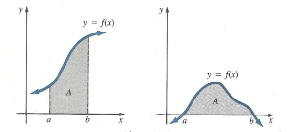
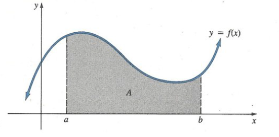

# Integration {#sec-integration}

::: {.epigraph}
If it's your job to eat a frog, it's best to do it first thing in the morning. And If it's your job to eat two frogs, it's best to eat the biggest one first.

[— Mark Twain]{.epigraph-by}
:::

## Anti-derivatives

In this chapter we shall see that an equally important problem is : $$Given~ a~ function~ f,~ find~ a~ function~ whose~ derivative~ is~ the~ same~ as~ f.$$ That is, for a given function $f$, we wish to find another function $F$ for which $F'(x)=f(x)$ for all $x$ on some interval.

::: {#def-integration-1}

A function $F$ is said to be an **anti-derivative** of a function $f$ if $F'(x)=f(x)$ on some interval.

:::

**Example:** An anti-derivative of $f(x)=2x$ is $F(x)=x^2$ since $F'(x)=2x$.

There is always more than one anti-derivative of a function. For instance, in the foregoing example, $F_1(x)=x^2-1$ and $F_2(x)=x^2+10$ are also anti-derivatives of $f(x)=2x$ since $F_1'(x)=F_2'(x)=f(x)$. Indeed, if $F$ is an anti-derivative of a function $f$, then so is $G(x)=F(x)+C$, for any constant $C$. This is a consequence of the fact that $$G'(x)=\dfrac{d}{dx}(F(x)+C)=F'(x)+0=F'(x)=f(x).$$ Thus, $F(x)+C$ stands for a **set of functions** of which each member has a derivative equal to $f(x)$.

::: {#thm-integration-1}

If $G'(x)=F'(x)$ for all $x$ in some interval $[a,b]$, then $$G(x)=F(x)+C$$ for all $x$ in the interval.

:::

**Examples:** (a)  The anti-derivative of $f(x)=2x$ is $G(x)=x^2+C$.
(b)  The anti-derivative of $f(x)=2x+5$ is $G(x)=x^2+5x+C$ since $G'(x)=2x+5$.

## Indefinite Integral 

For convenience let's introduce a notation for an anti-derivative of a function. If $F'(x)=f(x)$, we shall represent the most general anti-derivative of $f$ by $$\int f(x) dx =F(x) +C.$$ The symbol $\displaystyle \int$ is called an **integral sign**, and the notation $\displaystyle \int f(x)$ is called the **indefinite integral** of $f(x)$ with respect to $x$. The function $f(x)$ is called the **integrand**. The process of finding an anti-derivative is called **anti-differentiation** or **integration**. The number $C$ is called a **constant of integration**. Just as $\dfrac{d}{dx} ()$ denotes differentiation with respect to $x$, the symbol $\displaystyle \int ()dx$ denotes integration with respect to $x$.

## The Indefinite Integral of a Power

When differentiating the power $x^n$, we multiply by the exponent $n$ and decrease the exponent by $1$. To find an anti-derivative of $x^n$, the reverse of the differentiation rule would be : *Increase the exponent by $1$ and divide by the new exponent $n+1$*.

If $n$ is a rational number, then for $n\neq -1$ $$\int x^n dx =\dfrac{x^{n+1}}{n+1}+C.$$

::: {.proof}

Notice that $$\dfrac{d}{dx}\left(\dfrac{x^{n+1}}{n+1}+C\right) =(n+1)\dfrac{x^{(n+1)-1}}{n+1}+0 =x^n.$$

:::

**Example:** Evaluate (a)  $\displaystyle \int x^6\, dx$ (b)  $\displaystyle \int \dfrac{1}{x^5}\,  dx$.

**Solution:**
(a)  $\displaystyle \int x^6 \, dx =\dfrac{x^7}{7} +C$.
(b)  By writing $\dfrac{1}{x^5}$ as $x^{-5}$, we have $\displaystyle \int x^{-5}\, dx=\dfrac{x^{-4}}{-4}+C =-\dfrac{1}{4x^4}+C$.

**Example:** Evaluate $\displaystyle \int \sqrt{x}\,  dx$.

**Solution:** We first write $\displaystyle \int \sqrt{x}\, dx =\int x^{\frac{1}{2}}dx$ and therefore $$\int x^{\frac{1}{2}}dx =\dfrac{x^{\frac{3}{2}}}{\frac{3}{2}} +C=\frac{2}{3}x^{\frac{3}{2}} +C.$$

The following property of indefinite integrals is an immediate consequence of the fact that the derivative of a sum is the sum of derivatives.

::: {#thm-integration-2}

If $F'(x)=f(x)$ and $G'(x)=g(x)$, then $$\int [f(x) \pm g(x)]dx=\int f(x)dx \pm \int g(x)dx =F(x) \pm G(x) +C.$$

:::

**Example:** Evaluate $\displaystyle \int (x^{-\frac{1}{2}}+x^4)dx$.

**Solution:** We can write $$\int (x^{-\frac{1}{2}}+x^4)dx =\int x^{-\frac{1}{2}}dx +\int x^4 dx =\frac{x^{\frac{1}{2}}}{\frac{1}{2}}+\frac{x^5}{5}+C=2x^{\frac{1}{2}}+\frac{x^5}{5}+C.$$

::: {#thm-integration-3}

If $F'(x)=f(x)$, then $$\int kf(x)dx=k\int f(x)dx$$ for any constant $k$.

:::

The anti-derivative, or indefinite integral, of any finite sum can be obtained by integrating each term.

**Example:** Evaluate $\displaystyle \int \left(4x-2x^{-\frac{1}{3}}+\frac{5}{x^2} \right)dx$.

**Solution:** It follows that $$\begin{aligned}
\int \left(4x-2x^{-\frac{1}{3}}+\frac{5}{x^2} \right)dx &=  4\int x dx-2\int x^{-\frac{1}{3}}dx +5\int x^{-2}dx\\
&=  4\cdot \dfrac{x^2}{2}-2\cdot \dfrac{x^{\frac{2}{3}}}{\frac{2}{3}}+5\cdot \dfrac{x^{-1}}{-1}+C\\
&= 2x^2 -3x^{\frac{2}{3}}-5x^{-1} +C.
\end{aligned}$$

## Some Ant-Differentiation Formulas

1.  $\displaystyle \int cf(x)dx=c\int f(x)dx$.

2.  $\displaystyle \int [f(x)\pm g(x)]=\displaystyle \int f(x)dx \pm \displaystyle \int g(x)dx$.

3.  $\displaystyle \int x^n dx =\dfrac{1}{n+1} x^{n+1} + C$ for $n\neq -1$.

4.  $\displaystyle \int adx =ax +C$.

5.  $\displaystyle \int \cos x dx =\sin x +C$.

6.  $\displaystyle \int \sin x dx =-\cos x +C$.

7.  $\displaystyle \int\sec ^2 x dx =\tan x +C$.

8.  $\displaystyle \int e^x dx =e^x +C$.

9.  $\displaystyle \int \dfrac{1}{x} dx =\ln |x| +C$.

10. $\displaystyle \int \dfrac{1}{\sqrt{1-x^2}}dx =\sin ^{-1} x +C$.

11. $\displaystyle \int \dfrac{1}{1+x^2}dx= \tan ^{-1} x +C$.

**Example:** Evaluate $\displaystyle \int \left(\frac{5}{x}-2\sqrt[3]{x^2}\right)dx$.

**Solution:** We may write $$\begin{aligned}
\int \left(\frac{5}{x}-2\sqrt[3]{x^2}\right)dx &=  5\int \dfrac{1}{x} dx -2\int x^{\frac{2}{3}}dx\\
&=  5\ln |x| -2\dfrac{1}{\frac{5}{3}}x^{\frac{5}{3}} +C\\
&=  5\ln |x| -\frac{6}{5}x^{\frac{5}{3}} +C.
\end{aligned}$$

## $u-$Substitution

#### The Indefinite Integral of a Power of a Function

::: {#thm-integration-4}

If $F$ is an anti-derivative of $f$, then $$\int f(g(x))g'(x)dx=F(g(x))+C.$$

:::

**Example:** Evaluate $\displaystyle \int \dfrac{x}{(4x^2+3)^6} dx$.

**Solution:** Let us rewrite the integral as $$\int (4x^2+3)^{-6} xdx$$ and make the identifications $$u=4x^2+3 \quad \text{and} \quad du=8xdx.$$ $$\begin{aligned}
\int (4x^2+3)^{-6} xdx  &= \frac{1}{8} \int \overbrace{(4x^2+3)^{-6}}^{u^{-6}} \overbrace{8x dx}^{du}\\
&= \frac{1}{8}\int u^{-6} du \\
&=  \frac{1}{8} \cdot \frac{u^{-5}}{-5}+C\\
&=  -\frac{1}{40}(4x^2+3)^{-5} +C.
\end{aligned}$$

**Example:** Evaluate $\displaystyle \int x(x^2+2)^3 dx$.

**Solution:** If $u=x^2+2$ then $du=2xdx$. Thus, $$\begin{aligned}
\int x(x^2+2)^3 dx &=  \frac{1}{2} \int \overbrace{(x^2+2)^3}^{u^3} \overbrace{2xdx}^{du}\\
&=  \frac{1}{2}\int u^3 du\\
&=  \frac{1}{2}\cdot \frac{u^4}{4} +C\\
&=  \frac{1}{8} (x^2+2)^4 +C.
\end{aligned}$$

**You Try It:** Evaluate $\displaystyle \sqrt[3]{(7-2x^3)^4}x^2 dx$.

**Example:** Evaluate $\displaystyle \int \sin 10x\, dx$.

**Solution:** If $u=10x$, we then need $du=10dx$. Accordingly, we write $$\begin{aligned}
\int \sin 10x\, dx &=  \frac{1}{10} \int \sin 10x (10dx)\\
&=  \frac{1}{10} \int \sin u \,  du\\
&=  \frac{1}{10} (-\cos u) +C\\
&=  -\frac{1}{10}\cos 10x +C.
\end{aligned}$$

**You Try It:** Evaluate $\displaystyle \int \sec ^2 (1-4x)\, dx$.

## Sigma Notation

It is helpful to introduce a special notation that enables us to write an indicated sum of constants such as $1+2+3+\cdots +n, \, 2^2+4^2+6^2 +\cdots + (2n)^2$ and $\dfrac{1}{3} +\dfrac{1}{4}+\dfrac{1}{5}+\cdots +\dfrac{1}{2n-1}$ in a concise manner.

Let $a_k$ be a real number depending on the integer $k$. We denote the sum $$a_1+a_2+a_3+\cdots + a_n$$ by the symbol $$\sum _{k=1}^n a_k.$$ Since $\sum$ is the capital Greek letter sigma, it is called **sigma notation** or **summation notation**. The variable $k$ is called the **index of summation**. Thus, $\displaystyle \sum _{k=1}^n a_k$ is the sum of all numbers of the form $a_k$ as $k$ takes on the successive values $k=1, k=2, \cdots$, and concludes with $k=n$.

**Examples:** (a)  $\displaystyle \sum _{k=1}^5 (3k-1)=[3(1)-1]+[3(2)-1]+[3(3)-1]+[3(4)-1]+[3(5)-1]=2+5+8+11+14$.
(b)  $\displaystyle \sum _{k=1}^4 \dfrac{1}{(k+1)^2}=\dfrac{1}{2^2}+\dfrac{1}{3^2}+\dfrac{1}{4^2}+\dfrac{1}{5^2}$.
(c)  $\displaystyle \sum _{k=1}^{100}k^3=1^3+2^3+3^3+\cdots +98^3+99^3+100^3$.

The index of summation is often called a **dummy variable** since the symbol itself is not important, it is the successive integer values of the index and the corresponding sum that are important. In general, $$\sum _{k=1}^n a_k =\sum _{i=1}^n a_i =\sum _{j=1}^n a_j =\sum _{m=1}^n a_m$$ and so on.

### Summation Formulas

The number $n$ is a positive integer, then

1.  $\displaystyle \sum _{k=1}^n c =nc$.

2.  $\displaystyle \sum _{k=1}^n k =\dfrac{n(n+1)}{2}$.

3.  $\displaystyle \sum _{k=1}^n k^2 =\dfrac{n(n+1)(2n+1)}{6}$.

4.  $\displaystyle \sum _{k=1}^n k^3 =\dfrac{n^2(n+1)^2}{4}$.

5.  $\displaystyle \sum _{k=1}^n k^4 =\dfrac{n(n+1)(6n^3+9n^2+n-1)}{30}$.

**Example:** Evaluate $\displaystyle \sum _{k=1}^{10}(k+2)^3$.

**Solution:** By the Binomial Theorem, we can write as $$\begin{aligned}
\sum _{k=1}^{10}(k+2)^3 &=  \sum _{k=1}^{10}(k^3+6k^2+12k+8)\\
&=  \sum _{k=1}^{10} k^3 +6\sum _{k=1}^{10} k^2 +12\sum _{k=1}^{10} k +\sum _{k=1}^{10} 8.
\end{aligned}$$ With $n=10$, it follows from the summation formulas, that $$\begin{aligned}
\sum _{k=1}^{10}(k+2)^3 &=  \dfrac{10^2{11}^2}{4}+6\dfrac{10(11)(21)}{6}+12\dfrac{10(11)}{2}+10\cdot 8\\
&=  3025 +2310+660+80=6075.
\end{aligned}$$

## Area Under a Graph

As the derivative is motivated by the geometric problem of constructing a tangent to a curve, the historical problem leading to the definition of a definite integral is the problem of finding area. Specifically, we are interested in finding the area $A$ of a region bounded between the $x-$axis, the graph of a non-negative function $y=f(x)$ defined on some interval $[a,b]$ and

::: {.labelled}

- \(i\) the vertical lines $x=a$ and $x=b$.

- \(ii\) the $x-$intercepts of the graph.

:::

{fig-align="center" width=593px}

## Riemann Sums

Thinking integral as area, you can approximate the value of an integral by approximating the area. A **Riemann Sum** is a sum of areas of rectangles. To estimate $\displaystyle \int _a^b f(x)\, dx$, where $a<b$.

{fig-align="center" width=551px}

First, divide the interval $[a,b]$ into $n$ subintervals, using $x_0, x_1, x_2, \dots , x_n$ as endpoints for the subintervals, $$a=x_0<x_1<\cdots <x_{n-1}<x_n=b.$$ The subintervals are then $$[x_0, x_1], [x_1, x_2], \cdots , [x_{n-1}, x_n].$$ For simplicity, let the subintervals have the same length, $\Delta x =\dfrac{b-a}{n}$. You then have $x_i=a+i\Delta x$. Choose a point $c$ in each subinterval and construct a rectangle above the subinterval with height $f(c)$. For simplicity, above the $i$th subinterval $[x_{i-1}, x_i]$ make the height of the rectangle $f(x_i)$. The sum of the area of the rectangles is an approximation to $\displaystyle \int _a^b f(x)\, dx$. The $i$th rectangle has width $\Delta x$ and height $f(x_i)$, hence the area $A_i=f(x_i)\Delta x$. Thus : $$\begin{aligned}
\int _a^b f(x)\, dx &\approx   A_1 +A_2 +\cdots +A_n \\
&=  f(x_1)\Delta x +f(x_2)\Delta x +\cdots +f(x_n)\Delta x \\
&=  \sum _{i=1}^n f(x_i)\Delta x.
\end{aligned}$$ This is the Riemann Sum for the integral $\displaystyle \int _a^b f(x)\, dx$. In general, if you increase $n$, you will improve your approximation.

**Example:** Find the area of the region bounded by the graphs of $f(x)=2x, \, x=0, \, x=1$ and the $x$-axis by calculating the limit of the Riemann Sums.

**Solution:** First divide the interval $[0,1]$ into $n$ subintervals of equal length, $$\Delta x =\dfrac{b-a}{n}=\dfrac{1-0}{n}=\dfrac{1}{n}.$$ Therefore, $$x_i=a+i\Delta x =0+i\cdot \dfrac{1}{n}=\dfrac{i}{n}.$$ The $n$th Riemann Sum is $$\begin{aligned}
\sum _{i=1}^n f(x_i)\Delta x &=  \sum _{i=1}^n f\left(\dfrac{i}{n}\right) \Delta x \\
&=  \sum _{i=1}^n 2\left(\dfrac{i}{n}\right) \Delta x =\sum _{i=1}^n 2\left(\dfrac{i}{n}\right)\left(\dfrac{1}{n}\right)\\
&= \sum _{i=1}^n \dfrac{2}{n^2}i
\end{aligned}$$ Inside the summation, $\dfrac{2}{n^2}$ does not involve $i$, and so you can pull it outside the summation. $$\begin{aligned}
\sum _{i=1}^n \dfrac{2}{n^2}i &=  \dfrac{2}{n^2}\sum _{i=1}^n i \\
&=  \dfrac{2}{n^2}\left[\dfrac{n(n+1)}{2}\right] =\dfrac{2n^2+2n}{2n^2}\\
&=  1+\dfrac{1}{n}.
\end{aligned}$$ Finally, you can find the limit of the Riemann Sums : $$\lim _{n\rightarrow \infty} \sum _{i=1}^n f(x_i)\Delta x =\lim _{n\rightarrow \infty} \left(1+\dfrac{1}{n}\right)=1.$$

**Example:** Find the area of the region bounded by the graphs of $f(x)=(x-1)^2+2, \, x=-1, \, x=2$ and the $x$-axis by finding the limit of the Riemann Sums.

**Solution:** Divide $[-1,2]$ as follows $\Delta x =\dfrac{2-(-1)}{n}=\dfrac{3}{n}$, then $x_i=a+i\Delta x =-1+\dfrac{3i}{n}$. Then, the $n$th Riemann Sum is
$$\begin{aligned}
\sum _{i=1}^n f(x_i)\Delta x &= \sum _{i=1}^n f\left(-1+\dfrac{3i}{n}\right) \cdot \dfrac{3}{n} \\
&=  \sum _{i=1}^n \left[\left(-1+\dfrac{3i}{n}-1\right)^2+2\right]\cdot \dfrac{3}{n} \\
&=  \sum _{i=1}^n  \left[\left(\dfrac{3i}{n}-2\right)^2+2\right]\cdot \dfrac{3}{n} \\
&=  \sum _{i=1}^n \left[\dfrac{9i^2}{n^2}-\dfrac{12i}{n}+4+2\right] \cdot \dfrac{3}{n} 
\end{aligned}$$ $$\begin{aligned}
&=  \sum _{i=1}^n \left[\dfrac{27}{n^3}i^2-\dfrac{36}{n^2}i+\dfrac{18}{n}\right]\\
&=  \dfrac{27}{n^3}\sum _{i=1}^n i^2-\dfrac{36}{n^2}\sum _{i=1}^n i+\dfrac{18}{n}\sum _{i=1}^n 1\\
&=  \dfrac{27}{n^3} \left[\dfrac{n(n+1)(2n+1)}{6}\right]-\dfrac{36}{n^2}\left[\dfrac{n(n+1)}{2}\right]+\dfrac{18}{n}(n)\\
&= \dfrac{9(n+1)(2n+1)}{2n^2}-\dfrac{18(n+1)}{n}+18.
\end{aligned}$$ The area is the limit of the Riemann Sum $$\lim _{n\rightarrow \infty} \sum _{i=1}^n f(x_i)\Delta x =\lim _{n\rightarrow \infty} \left[ \dfrac{9(n+1)(2n+1)}{2n^2}-\dfrac{18(n+1)}{n}+18\right] =9-18-18 =9.$$

**You Try It:** Find the area of the function $f(x)=x$ on $[0,1]$ by finding the limit of the Riemann Sums.

### The Definite Integral

The geometric problems that motivated the development of the integral calculus (determination of lengths, areas, and volumes) arose in the ancient civilizations of Northern Africa. Where solutions were found, they related to concrete problems such as the measurement of a quantity of grain. Greek philosophers took a more abstract approach. In fact, Eudoxus (around 400 B.C.) and Archimedes (250 B.C.) formulated ideas of integration as we know it today. Integral calculus developed independently, and without an obvious connection to differential calculus. The calculus became a ''whole'' in the last part of the seventeenth century when Isaac Barrow, Isaac Newton, and Gottfried Wilhelm Leibniz (with help from others) discovered that the integral of a function could be found by asking what was differentiated to obtain that function.

::: {#def-integration-2}

Let $f$ be a function defined on a closed interval $[a,b]$. Then the **definite integral** of $f$ from $a$ to $b$, denoted by $\displaystyle \int _{a}^b f(x)\, dx$, is defined to be $$\int _{a}^b f(x)\, dx =\lim _{n\rightarrow \infty}\sum _{i=1}^n f(x_i)\Delta x.$$

:::

The numbers $a$ and $b$ are called the **lower** and **upper limits of integration**, respectively. If the limit exists, the function $f$ is said to be **integrable** on the interval.

### Properties of the Definite Integral

The following two definitions prove to be useful when working with definite integrals.

::: {#thm-integration-5}

If $f(a)$ exists, then $$\int _a^a f(x)dx=0.$$

:::

::: {#thm-integration-6}

If $f$ is integrable on $[a,b]$, then $$\int _b^a f(x)dx=-\int _a^b f(x)dx.$$

:::

**Example:** By definition $$\int _1^1 (x^3+3x)dx=0.$$

::: {#thm-integration-7}

Let $f$ and $g$ be integrable functions on $[a,b]$. Then,

::: {.labelled}

- \(i\) $\displaystyle \int _{a}^b kf(x)\, dx=k\int _{a}^b f(x)\, dx$ where $k$ is any constant.

- \(ii\) $\displaystyle \int _{a}^b [ f(x) \pm g(x)]\, dx=\int _{a}^b f(x)\, dx \pm \int _{a}^b g(x)\, dx$.

- \(iii\) $\displaystyle \int _{a}^b f(x)\, dx=\int _{a}^c f(x)\, dx +\int _{c}^b f(x)\, dx$, where $c$ is any number in $[a,b]$.

:::

:::

The independent variable $x$ in a definite integral is called a **dummy variable** of integration. The value of the integral does not depend on the symbol used. In other words, $$\int _{a}^b f(x)\, dx =\int _{a}^b f(r)\, dr =\int _{a}^b f(s)\, ds =\int _{a}^b f(t)\, dt$$ and so on.

::: {#thm-integration-8}

For any constant $k$, $$\int _{a}^b k\, dx =k\int _{a}^b dx=k(b-a).$$

:::

::: {#thm-integration-9}

Let $f$ be integrable on $[a,b]$ and $f(x)\geq 0$ for all $x$ in $[a,b]$, then $$\int _{a}^b f(x)\, dx\geq 0.$$

:::

## The Fundamental Theorem of Calculus

In this theorem we shall see that the concept of an anti-derivative of a continuous function provides the bridge between the differential calculus and the integral calculus.

::: {#thm-integration-10}

Let $f$ be continuous on $[a,b]$ and let $F$ be any function for which $F'(x)=f(x)$. Then $$\int _{a}^b f(x)\, dx=F(b)-F(a).$$

:::

The difference is usually written $$F(x)\biggl|_{a}^b,$$ that is, $$\underbrace{\int _a^b f(x)\, dx}_{\text{definite integral}} =\underbrace{\int f(x)\, dx\biggl|_a^b}_{\text{indefinite integral}} =F(x)\biggl|_{a}^b.$$

**Example:** Evaluate $\displaystyle \int _{1}^3 x\, dx$.

**Solution:** An anti-derivative of $f(x)=x$ is $F(x)=\dfrac{x^2}{2}$. Consequently, $$\int _{1}^3 x\, dx =\dfrac{x^2}{2}\biggl|_{1}^3=\dfrac{9}{2}-\dfrac{1}{2}=4.$$

## Techniques of Integration

### Integration by Parts

Useful for integrands involving products of algebraic and exponential or logarithmic functions, such as $\displaystyle \int x^2e^x\, dx$ and $\displaystyle \int x\ln x\, dx$. This is the inverse operation of differentiating a product. If $u$ and $v$ are functions of $x$, then $$\dfrac{d}{dx}(uv)=u\dfrac{dv}{dx}+v\dfrac{du}{dx}.$$ Integrate both sides, if $\dfrac{du}{dx}$ and $\dfrac{dv}{dx}$ are continuous, then $$\begin{aligned}
uv &=  \int u\dfrac{dv}{dx}\, dx +\int v\dfrac{du}{dx}\, dx \\
\int u \dfrac{dv}{dx}\, dx &=  uv -\int v\dfrac{du}{dx}\, dx \\
\int u \, dv &=  uv -\int v\, du.
\end{aligned}$$

**Example:** Evaluate $\displaystyle \int xe^x \, dx$.

**Solution:** Let $u=x, \, du=dx$ and $dv=e^x\, dx\Rightarrow v=\displaystyle \int dv=\int e^x\, dx=e^x$. Then, $$\int xe^x \, dx=xe^x-e^x+C.$$

**Example:** Evaluate $\displaystyle \int x^2 \ln x\, dx$.

**Solution:** $x^2$ is more easily integrated than $\ln x$. So choose $dv=x^2\, dx$. Then, $$dv=x^2\, dx \Rightarrow v=\int dv =\int x^2 \, dx =\dfrac{x^3}{3}.$$ and $u=\ln x \Rightarrow du=\dfrac{1}{x}\, dx$. Therefore, $$\begin{aligned}
\int x^2 \ln x\, dx &=  \dfrac{x^3}{3}\ln x -\int \left(\dfrac{x^3}{3}\right)\left(\dfrac{1}{x}\right)\, dx\\
&=  \dfrac{x^3}{3}\ln x -\dfrac{1}{3}\int x^2\, dx \\
&=   \dfrac{x^3}{3}\ln x -\dfrac{x^3}{9}+C.
\end{aligned}$$

**Example:** Evaluate $\displaystyle \int \ln x \, dx$.

**Solution:** Choose $dv=dx \Rightarrow v=\displaystyle \int dv=\int dx=x$ and $u=\ln x\Rightarrow du=\dfrac{1}{x}\, dx$, therefore $$\begin{aligned}
\int \ln x\, dx &=  x\ln x -\int x\cdot \dfrac{1}{x}\, dx \\
&=  x\ln x -\int dx\\
&= x\ln x -x+C.
\end{aligned}$$

**You Try It:** Evaluate $\displaystyle \int x\tan ^{-1} x \, dx$.

## Using Integration by Parts Repeatedly

**Example:** Evaluate $\displaystyle \int x^2e^x\, dx$.

**Solution:** Notice that the derivative of $x^2$ becomes simpler, whereas the derivative of $e^x$ does not. So you should let $u=x^2$ and $dv=e^x\, dx$. So $$\begin{aligned}
dv=e^x\, dx  &\Rightarrow  v=\int dv=\int e^x\, dx =e^x\\
u=x^2 &\Rightarrow  du=2x\, dx.
\end{aligned}$$ Integrating by parts one time we get, $$\int x^2e^x\, dx =x^2e^x-\int 2xe^x\, dx.$$ Apply integration by parts a second time, where $$\begin{aligned}
dv=e^x \, dx &\Rightarrow  v=\int dv =\int e^x \, dx =e^x\\
u=2x &\Rightarrow  du=2\, dx.
\end{aligned}$$ Then, $$\begin{aligned}
\int x^2e^x\, dx &=  x^2e^x-\int 2xe^x\, dx\\
&=  x^2e^x-\left(2xe^x-\int 2e^x\, dx\right)\\
&=  x^2e^x-2xe^x+2e^x+C\\
&=  e^x(x^2-2x+2)+C.
\end{aligned}$$

## Evaluating a Definite Integral

**Example:** Evaluate $\displaystyle \int _{1}^e \ln x \, dx$.

**Solution:** $$\begin{aligned}
 \int _{1}^e \ln x \, dx &=  (x\ln x -x)\biggl |_{1}^e \\
 &=  (e\ln e -e)-(1\cdot \ln 1 -1)\\
 &=  (e-e)-(0-1)\\
 &=  1.
\end{aligned}$$

## Reduction Formulas

These are formulas in which a given integral is expressed in terms of similar integrals of simpler form.

**Example:** Let $n$ be a positive integer. Use integration by parts to derive the reduction formula $$\int x^n e^x\, dx =x^ne^x-n\int x^{n-1}e^x\, dx +C.$$

**Solution:** Let $u=x^n, \, dv=e^x\, dx$. Then $du=nx^{n-1}$, $v=\displaystyle \int dv=\int e^x \, dx=e^x$. So $$\begin{aligned}
\int x^ne^x\, dx &= x^ne^x-\int e^x(nx^{n-1})\, dx \\
&=  x^ne^x-n\int x^{n-1}e^x\, dx +C.
\end{aligned}$$ To illustrate the use of the reduction formula we calculate $\displaystyle \int x^ne^x\, dx$ for $n=1,2$. $$\begin{aligned}
n=1 &:  \int xe^x\, dx =xe^x-\int e^x\, dx=xe^x-e^x+C.\\
n=2 &:  \int x^2e^x\, dx =x^2e^x-2\int xe^x\, dx =x^2e^x-2xe^x+2e^x+C.
\end{aligned}$$

**Example:** Evaluate $\displaystyle \int \sin ^n x \, dx$.

**Solution:** Rewrite as $\displaystyle \int \sin ^n x\, dx =\int \sin ^{n-1}x \sin x\, dx$.
Then $u=\sin ^{n-1}x \Rightarrow du=(n-1)\sin ^{n-2}x \cos x\, dx$ and $dv=\sin x \Rightarrow \\ v=\displaystyle \int dv=\int \sin x \, dx =-\cos x$. Then , $$\begin{aligned}
\int \sin ^n x \, dx &= -\sin ^{n-1}x \cos x +(n-1)\int \sin ^{n-2}x \cos x \cos x \, dx\\
&= -\sin ^{n-1}x \cos x +(n-1)\int \sin ^{n-2}x \cos ^2 x\, dx\\
&= -\sin ^{n-1}x \cos x+(n-1)\int \sin ^{n-2}x (1-\sin ^2 x)\, dx\\
&= -\sin ^{n-1}x \cos x+(n-1)\left[\int \sin ^{n-2}x \, dx -\sin ^n x \, dx\right]\\
\int \sin ^n x \, dx +(n-1)\int \sin ^n x \, dx &= -\sin ^{n-1}x \cos x +(n-1)\int \sin ^{n-2}x \, dx\\
n\int \sin ^n x \, dx &= -\sin ^{n-1}x \cos x +(n-1)\int \sin ^{n-2}x \, dx \\
\int \sin ^n x \, dx &= - \dfrac{\sin ^{n-1}x\cos x}{n} +\dfrac{n-1}{n}\int \sin ^{n-2}x\, dx.
\end{aligned}$$

## Partial Fractions

This technique involves the decomposition of a rational function into the sum of two or more simpler rational functions. We will consider rational functions (quotients of polynomials) in which the numerator has a lower degree than the denominator. If this condition is not meet, we first carry out long division process, dividing the denominator into the numerator, until we reduce the problem to an equivalent one involving a fraction in which the numerator has a lower degree than the denominator.

**Example:** $\dfrac{x+7}{x^2-x-6}=\dfrac{2}{x-3}-\dfrac{1}{x+2}$, then $$\begin{aligned}
\int \dfrac{x+7}{x^2-x-6}\, dx &= \int \left(\dfrac{2}{x-3}-\dfrac{1}{x+2}\right)\, dx \\
&=  2\int \dfrac{1}{x-3}\, dx -\int \dfrac{1}{x+2}\, dx\\
&=  2\ln |x-3|-\ln |x+2| +C.
\end{aligned}$$

**You Try It:** Evaluate $\displaystyle \int \dfrac{2x+1}{(x-1)(x+3)}\, dx$.

### Integrating with Repeated Factors

**Example:** Find $\displaystyle \int \dfrac{5x^2+20x+6}{x^3+2x^2+x}\, dx$.

**Solution:** Factorise the denominator as $x(x+1)^2$. Then write the partial decomposition as $$\dfrac{5x^2+20x+6}{x(x+1)^2}=\dfrac{A}{x}+\dfrac{B}{x+1} +\dfrac{C}{(x+1)^2}.$$ Substituting we get, $A=6, \, B=-1, \, C=9$, then $$\begin{aligned}
 \int \dfrac{5x^2+20x+6}{x^3+2x^2+x}\, dx &=  \int \dfrac{6}{x}\, dx -\int \dfrac{1}{x+1}\, dx +\int \dfrac{9}{(x+1)^2}\, dx\\
 &=  6\ln |x|-\ln |x+1|+\dfrac{9(x+1)^{-1}}{-1} +C\\
 &=  \ln \left|\dfrac{x^6}{x+1}\right|-\dfrac{9}{x+1}+C.
 \end{aligned}$$

**You Try It:** Evaluate $\displaystyle \int \dfrac{6x-1}{x^3(2x-1)}\, dx$.

### Integrating an Improper Rational Function

**Example:** Find $\displaystyle \int \dfrac{x^5+x-1}{x^4-x^3}\, dx$.

**Solution:** This rational is improper, its numerator has a degree greater than that of its denominator. Carrying out long division, we have $$\dfrac{x^5+x-1}{x^4-x^3} =x+1 +\dfrac{x^3+x-1}{x^4-x^3}.$$ Now, applying partial fraction decomposition produces $$\dfrac{x^3+x-1}{x^3(x-1)} =\dfrac{A}{x}+\dfrac{B}{x^2}+\dfrac{C}{x^3}+\dfrac{D}{x-1}.$$ We see that $A=0, \, B=0, \, C=1$ and $D=1$. So now we can integrate, $$\begin{aligned}
 \int \dfrac{x^5+x-1}{x^4-x^3}\, dx &=  \int \left(x+1+\dfrac{x^3+x-1}{x^4-x^3}\right)\, dx\\
 &=  \int \left(x+1+\dfrac{1}{x^3}+\dfrac{1}{x-1}\right)\, dx\\
 &=  \dfrac{x^2}{2}+x-\dfrac{1}{2x^2}+\ln |x-1|+C.
 \end{aligned}$$

**You Try It:** Evaluate $\displaystyle \int \dfrac{x^3-2x}{x^2+3x+2}\, dx$.

### Quadratic Factors

**Example:** Find $\displaystyle \int \dfrac{dx}{x^2-4x+5}$.

**Solution:** Here we cannot find real factors, but we can complete the square, $$x^2-4x+5=(x-2)^2+1,$$ therefore $$\int \dfrac{dx}{x^2-4x+5} =\int \dfrac{dx}{(x-2)^2+1}=\tan ^{-1} (x-2) +C.$$

**Example:** Find $\displaystyle \int \dfrac{(x+3)dx}{x^2-4x+5}$.

**Solution:** Completing the square, $\dfrac{x+3}{x^2-4x+5}=\dfrac{x+3}{(x-2)^2+1}$. Now since $x+3=x-2+5$, we have $$\begin{aligned}
 \int \dfrac{(x+3)dx}{x^2-4x+5} &= \int \dfrac{(x-2+5)\, dx}{(x-2)^2+1}\\
 &=  \int \dfrac{(x-2)\, dx}{(x-2)^2+1} +\int \dfrac{5\, dx}{(x-2)^2+1}\\
 &=  \dfrac{1}{2}\ln ((x-2)^2+1)+5\tan ^{-1} (x-2)+C.
 \end{aligned}$$

**Example:** Find $\displaystyle \int \dfrac{(x+1)\, dx}{x(x^2+1)}$.

**Solution:** Decompose into partial fractions, $$\dfrac{x+1}{x(x^2+1)}=\dfrac{A}{x}+\dfrac{B+Cx}{x^2+1}.$$ Then $A=1, \, B=1, \, C=-1$, and our integral is $$\begin{aligned}
 \int \dfrac{(x+1)\, dx}{x(x^2+1)} &=  \int \dfrac{1}{x}\, dx +\int \dfrac{dx}{x^2+1}-\int \dfrac{x\, dx}{x^2+1}\\
 &=  \ln |x| +\tan ^{-1} x-\dfrac{1}{2}\ln (x^2+1)+C.
 \end{aligned}$$

**You Try It:** Evaluate $\displaystyle \int \dfrac{4x}{(x^2+1)(x^2+2x+3)}\, dx$.

## Integration of Rational Functions of Sine and Cosine

Integrals of rational expressions that involve $\sin x$ and $\cos x$ can be reduced to integrals of quotients of polynomials by means of the substitution $$t=\tan \left(\dfrac{x}{2}\right).$$ It then follows that $\cos x=\dfrac{1-t^2}{1+t^2}, \, \sin x =\dfrac{2t}{1+t^2}$ and $\dfrac{dx}{dt}=\dfrac{2}{1+t^2}$.

**Example:** Evaluate $\displaystyle \int \dfrac{dx}{2+2\sin x+\cos x}$.

**Solution:** We see that $$\int \dfrac{dx}{2+2\sin x+\cos x} =\int \dfrac{2\, dt}{t^2+4t+3}.$$ Since $t^2+4t+3=(t+1)(t+3)$, we use partial fractions, $$\begin{aligned}
 \int \dfrac{dx}{2+2\sin x+\cos x} &= \int \left(\dfrac{1}{t+1}-\dfrac{1}{t+3}\right)\, dt\\
 &=  \ln |t+1|-\ln |t+3|+C\\
 &= \ln \left|\dfrac{t+1}{t+3}\right| +C\\
 &= \ln \left|\dfrac{1+\tan \frac{x}{2}}{3+\tan \frac{x}{2}}\right| +C.
\end{aligned}$$

**Example:** Evaluate $\displaystyle \int \dfrac{dx}{5+3\cos x}$.

**Solution:** The integral becomes $$\begin{aligned}
\int \dfrac{dx}{5+3\cos x} &=  \int \dfrac{\dfrac{2dt}{1+t^2}}{5+3\left(\dfrac{1-t^2}{1+t^2}\right)}\\
&=  \int \dfrac{\dfrac{2dt}{1+t^2}}{\dfrac{5(1+t^2)+3(1-t^2)}{1+t^2}} = \int \dfrac{2dt}{8+2t^2}\\
&=  \int \dfrac{dt}{t^2+4} = \dfrac{1}{2}\tan ^{-1} \left(\frac{t}{2}\right) +C\\
&=  \dfrac{1}{2}\tan ^{-1} \left(\dfrac{1}{2}\tan \frac{x}{2}\right)+C.
\end{aligned}$$

**You Try It:** Evaluate $\displaystyle \int \dfrac{dx}{5+4\cos x}$.

## Integration of Powers of Trigonometric Functions

With the aid of trigonometric identities, it is possible to evaluate integrals of the type $$\int \sin ^m x \cos ^n x \, dx.$$ We distinguish two cases.
**Case 1: $m$ or $n$ is an odd positive integer.** Let us first assume that $m$ is an odd positive integer. By writing $$\sin ^m x =\sin ^{m-1}x \sin x,$$ where $m-1$ is even, and using $\sin ^2 x =1-\cos ^2 x$, the integrand can be expressed as a *sum* of powers of $\cos x$ times $\sin x$.

**Example:** Evaluate $\displaystyle \int \sin ^3 x\, dx$.

**Solution:** $$\begin{aligned}
\int \sin ^3 x\, dx &= \int \sin ^2 x\sin x \, dx\\
&=  \int (1-\cos ^2 x)\sin x \, dx \\
&= \int \sin x\, dx +\int \cos ^2 x (-\sin x)\, dx\\
&=  -\cos x +\dfrac{1}{3}\cos ^3 x +C.
\end{aligned}$$

**Example:** Evaluate $\displaystyle \int \sin ^5 x \cos ^2x\, dx$.

**Solution:** $$\begin{aligned}
\int \sin ^5 x \cos ^2 x\, dx &=  \int \cos ^2 x\sin ^4 x \sin x\, dx\\
&=  \int \cos ^2 x (\sin ^2 x)^2 \sin x \, dx\\
&=  \int \cos ^2 x (1-\cos ^2 x)^2 \sin x \, dx\\
&=  \int \cos ^2 x (1-2\cos ^2 x+\cos ^4 x)\sin x \, dx\\
&=  -\int \cos ^2 x (-\sin x)\, dx +2\int \cos ^4 x (-\sin x)\, dx -\int \cos ^6 x(-\sin x)\, dx \\
&= -\dfrac{1}{3}\cos ^3 x +\dfrac{2}{5}\cos ^5 x-\dfrac{1}{7}\cos ^7 x +C.
\end{aligned}$$ If $n$ is an odd positive integer, the procedure for evaluation is the same except that we seek an integrand that is the sum of powers of $\sin x$ times $\cos x$.

**Example:** Evaluate $\displaystyle \int \sin ^4 x \cos ^3 x\, dx$.

**Solution:** $$\begin{aligned}
\int \sin ^4 x \cos ^3 x\, dx &=  \int \sin ^4 x \cos ^2 x \cos x\, dx\\
&=  \int \sin ^4 x (1-\sin ^2 x)\cos x\, dx\\
&=  \int \sin ^4 x (\cos x)\, dx -\sin ^6 x (\cos x)\, dx\\
&= \dfrac{1}{5}\sin ^5 x -\dfrac{1}{7}\sin ^7 x +C.
\end{aligned}$$ **You Try It:** Evaluate $\displaystyle \int \sin ^2 x \cos ^3 x \, dx$.

**Case II: $m$ and $n$ are both even non-negative integers.** When both $m$ and $n$ are even non-negative integers, the evaluation of the integral relies heavily on the identities, $$\sin x \cos x =\dfrac{1}{2}\sin 2x, \quad \sin ^2 x =\dfrac{1-\cos 2x}{2}, \quad \cos ^2 x =\dfrac{1+\cos 2x}{2}.$$

**Example:** Evaluate $\displaystyle \int \cos ^4 x \, dx$.

**Solution:** $$\begin{aligned}
 \int \cos ^4 x \, dx &=  \int (\cos ^2 x)^2 \,dx\\
 &=  \int \left(\dfrac{1+\cos 2x}{2}\right)^2 \, dx\\
 &=  \dfrac{1}{4}\int (1+2\cos 2x +\cos ^2 2x)\, dx\\
 &= \dfrac{1}{4}\int \left(1+2\cos 2x+\dfrac{1+\cos 4x}{2}\right)\, dx\\
 &=  \dfrac{1}{4} \int \left(\dfrac{3}{2}+2\cos 2x+\dfrac{1}{2}\cos 4x\right)\, dx\\
 &=  \dfrac{3}{8}x+\dfrac{1}{4}\sin 2x +\dfrac{1}{32}\sin 4x +C.
\end{aligned}$$ **You Try It:** Evaluate $\displaystyle \int \sin ^2 x \cos ^2 x\, dx$.

Instead of $\sin ^8 x \cos ^6 x$, suppose you have $\sin 8x\cos 6x$.

**Example:** Find $\displaystyle \int _0^{2\pi}\sin 8x \cos 6x \, dx$.

More generally, find $\displaystyle \int _0^{2\pi} \sin px \cos qx\, dx$. Use the identity $$\sin px \cos qx =\dfrac{1}{2}\sin (p+q)x +\dfrac{1}{2}\sin (p-q)x.$$ Thus $\sin 8x\cos 6x=\dfrac{1}{2}\sin 14x +\dfrac{1}{2}\sin 2x$. Separated like this, sine are easy to integrate, $$\int _{0}^{2\pi}\sin 8x \cos 6x \, dx =\left(-\dfrac{1}{2}\dfrac{\cos 14x}{14}-\dfrac{\cos 2x}{4}\right)\biggl| _{0}^{2\pi}=0.$$ With two sines or two cosines, the addition formula, derive these formulas, $$\begin{aligned}
\sin px \cos qx  &=  -\dfrac{1}{2}\cos (p+q)x+\dfrac{1}{2}\cos (p-q)x.\\
\cos px \cos qx &=  \dfrac{1}{2}\cos (p+q)x +\dfrac{1}{2}\cos (p-q)x.
\end{aligned}$$

**You Try It:** Evaluate $\displaystyle \int \sin 2x \sin 4x\, dx$.

## Tutorial questions {.unnumbered}

::: {.tutorial}

1.  Find the area of the region bounded by the graphs of $f(x)=2(x+2)^3, x=-2, x=0$ and the $x$-axis by calculating the Riemann sums.

2.  Show that the function $f(x)=x$ on $[0,1]$ is Riemann integrable by calculating the Riemann sums.

3.  Evaluate the following.
    (i)  $\displaystyle \int (x+2)\sin (x^2+4x-6)dx$ (ii)  $\displaystyle \int x^2e^{\sin x^3}\cos x^3 dx$ (iii)  $\displaystyle \int \dfrac{\tan ^{-1} x}{1+x^2}dx$
    (iv)  $\displaystyle \int \dfrac{dx}{x(\ln x)^4}$ (v)  $\displaystyle \int x^2\sqrt{2x^3-4}dx$ (vi)  $\displaystyle \int \dfrac{3x}{\sqrt[3]{2x^2+3}}dx$ (vii)  $\displaystyle \int \dfrac{x\sin ^{-1}x^2}{\sqrt{1-x^4}}dx$.

4.  Integrate (i)  $\dfrac{1}{(x^2+1)(x+1)}$ (ii)  $\dfrac{x+5}{(2x-1)(x+3)}$ (iii)  $\dfrac{2x-5}{(x^2+4)(x+6)}$.

5.  Evaluate each of the following integrals by using an appropriate substitution.
    (i)  $\displaystyle \int \dfrac{x^5 dx}{\sqrt{x^3+1}}$ (ii)  $\displaystyle \int x^7\sqrt{x^4+1}dx$ (iii)  $\displaystyle \int \sqrt{\dfrac{1+x}{1-x}}dx$ (iv)  $\displaystyle \int \dfrac{x}{2+\sqrt{x+1}}dx$
    (v)  $\displaystyle \int  \dfrac{x^{\frac{2}{3}}}{1+x^{\frac{1}{2}}}dx$ (vi)  $\displaystyle \int \dfrac{1}{x^{\frac{1}{2}}+x^{\frac{1}{4}}}dx$ (vii)  $\displaystyle \int \dfrac{\sqrt[3]{x}}{1+\sqrt{x}}dx$.

6.  Evaluate each of the following integrals.
    (i)  $\displaystyle \int \sin ^3 x dx$ (ii)  $\displaystyle \int \sin x \cos x dx$ (iii)  $\displaystyle \int \sin ^3 x \cos ^3 x dx$ (iv)  $\displaystyle \int \sin 6x \cos 3x dx$ (v)  $\displaystyle \int \cos x \cos 4x dx$ (vi)  $\displaystyle \int \sin 2x\sin 4x\, dx$ (vii)  $\displaystyle \int _0^{\frac{\pi}{2}}\sin \frac{3}{2}x \cos \frac{1}{2}x\, dx$.

7.  Use a suitable substitution to evaluate the following integrals.
    (i)  $\displaystyle \int \sec \theta d\theta$ (ii)  $\displaystyle \int \dfrac{d\theta}{1+\sin \theta}$ (iii)  $\displaystyle \dfrac{\sin \theta}{2+\sin \theta}d\theta$ (iv)  $\displaystyle \int \dfrac{d\theta}{a+b\cos \theta}$ if $a>b>0$.

8.  Evaluate each of the following integrals.
    (i)  $\displaystyle \int xe^{3x}dx$ (ii)  $\displaystyle \int e^x\sin x dx$ (iii)  $\displaystyle \int \tan ^{-1} x dx$ (iv)  $\displaystyle \int e^{ax}\cos px dx$(v)  $\displaystyle \int x^3\cos x dx$.

9.  - \(a\) Show that $\displaystyle \int x^m \ln x dx=x^{m+1}\left(\dfrac{\ln x}{m+1}-\dfrac{1}{(m+1)^2} \right), \, m \neq -1$.

    ::: {.labelled}

    - \(b\) Show that $\displaystyle \int \sin ^n x dx=\dfrac{-\sin ^{n-1}x \cos x}{n}+\dfrac{n-1}{n}\int \sin ^{n-2}x dx, \, n\neq 0$.

    - \(c\) Show that $\displaystyle \int x^n e^{ax}dx=\dfrac{x^ne^{ax}}{a}-\dfrac{n}{a}\int x^{n-1}e^{ax}dx, \, n>0$.

    - \(d\) Show that $\displaystyle \int \sin ^m x \cos ^n x dx=-\dfrac{\sin ^{m-1}x \cos ^{n+1}x}{m+n}+\dfrac{m-1}{m+n}\int \sin ^{m-2} x \cos ^n xdx$ and so find $\displaystyle \int \sin ^6x \cos ^5 x dx$.

    - \(e\) Let $I_n=\displaystyle \int \sec ^n x dx, \, n=2,3,\dots$. Show that $I_n=\dfrac{\sec ^{n-2}x \tan x}{n-1}+\dfrac{n-2}{n-1}I_{n-2}$.

    - \(f\) Let $I_n=\displaystyle \int (\ln x)^n dx, n=1,2,\dots$. Show that $I_n=x(\ln x)-nI_{n-1}$.

    - \(g\) Let $\displaystyle I_n=\int x^ne^xdx, n=1,2,3,\dots$. Show that $I_n=x^ne^x-I_{n-1}$. Find $\displaystyle \int x^3e^xdx$.

    - \(h\) Let $I_n=\displaystyle \int (1+ax^2)^n dx$. Show that $(2n+1)I_n=2nI_{n-1}+x(1+ax^2)^n$.

    - \(i\) Let $\displaystyle \int _{0}^a (x^2+a^2)^{\frac{n}{2}}dx$. Show that $(n+1)I_n=2^{\frac{n}{2}}a^{n+1}+na^2I_{n-2}$.

    :::

:::
